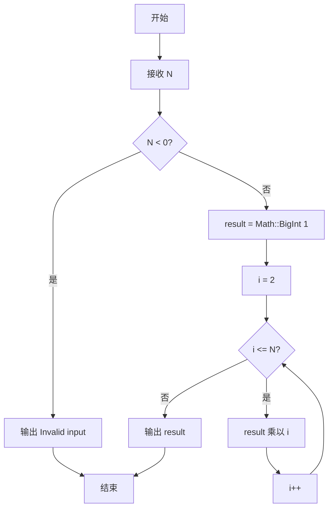
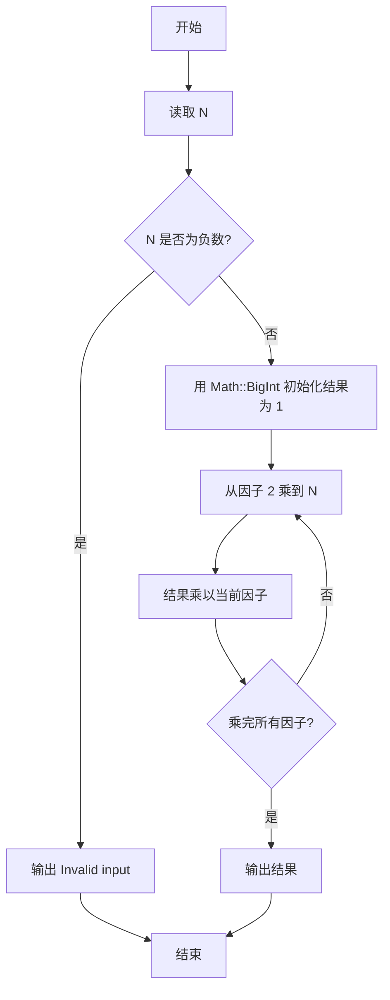

# PTA基础编程题目集 6-10阶乘计算升级版（Perl语言实现）

## 题目描述

本题要求实现一个打印非负整数阶乘的函数。

### 函数接口定义

```perl
sub Print_Factorial {
    my ($N) = @_;   # N 非负时在一行打印 N!，否则打印 "Invalid input"
}
```

其中`N`是用户传入的参数，其值不超过1000。如果`N`是非负整数，则该函数必须在一行中打印出`N`!的值，否则打印“Invalid input”。

### 裁判测试程序样例

```perl
sub Print_Factorial {
    my ($N) = @_;
    # 你的代码将被嵌在这里
}

my $N = <STDIN>;
chomp $N;
Print_Factorial($N);
```

### 输入样例

```in
15
```

### 输出样例

```out
1307674368000
```

## 解题思路

这道题的核心是**大数阶乘**：`$N` 最大为 1000，1000! 远超普通整数的表示范围，必须利用 Math::BigInt 模块的任意精度整数做累乘，同时要先处理 `$N` 为负数的非法输入。

### 核心问题分析

1. **非法输入处理**：`$N < 0` 时直接打印 "Invalid input" 并返回。
2. **大数运算**：用 `Math::BigInt->new(1)` 初始化结果为 1，从因子 2 循环乘到 `$N`，每轮调用 `$result->bmul($i)` 乘以当前因子，避免普通整数溢出。
3. **结果输出**：循环结束后用 `$result->bstr()` 把大数转成字符串输出。

### 算法原理说明

`$N` 最大为 1000，1000! 远超普通整数的表示范围，必须用**大数运算**。Perl 中直接利用 Math::BigInt 模块提供任意精度整数：用 `Math::BigInt->new(1)` 初始化结果为 1，然后从因子 2 循环乘到 `$N`，每轮调用 `$result->bmul($i)` 乘以当前因子，最后用 `$result->bstr()` 转成字符串输出。`$N` 为负数时直接打印 "Invalid input"。

### 具体计算步骤

1. 判断 `$N < 0`：成立则 `print "Invalid input\n"` 并 return。
2. 用 `Math::BigInt->new(1)` 初始化大数结果 `$result` 为 1（对应 0!）。
3. `for my $i (2 .. $N)` 从因子 2 循环到 `$N`。
4. 每轮调用 `$result->bmul($i)` 把结果乘以当前因子。
5. 循环结束后 `print $result->bstr(), "\n"` 输出结果字符串。

## 完整代码

```perl
use strict;
use warnings;
use Math::BigInt;

# 6-10 阶乘计算升级版
# 实现：Math::BigInt 任意精度累乘，N≤1000，N<0 打印 Invalid input，0! =1
sub Print_Factorial {
    my ($N) = @_;
    if ($N < 0) {
        print "Invalid input\n";
        return;
    }
    my $result = Math::BigInt->new(1);
    for my $i (2 .. $N) {
        $result->bmul($i);
    }
    print $result->bstr(), "\n";
}

chomp(my $N = <STDIN>);
Print_Factorial($N);
```

## 代码流程说明

1. 判断 `$N < 0`：成立则 `print "Invalid input\n"` 并 return。
2. 用 `Math::BigInt->new(1)` 初始化大数结果 `$result` 为 1（对应 0!）。
3. `for my $i (2 .. $N)` 从因子 2 循环到 `$N`。
4. 每轮调用 `$result->bmul($i)` 把结果乘以当前因子。
5. 循环结束后 `print $result->bstr(), "\n"` 输出结果字符串。

## 代码流程图



## 解题流程图


