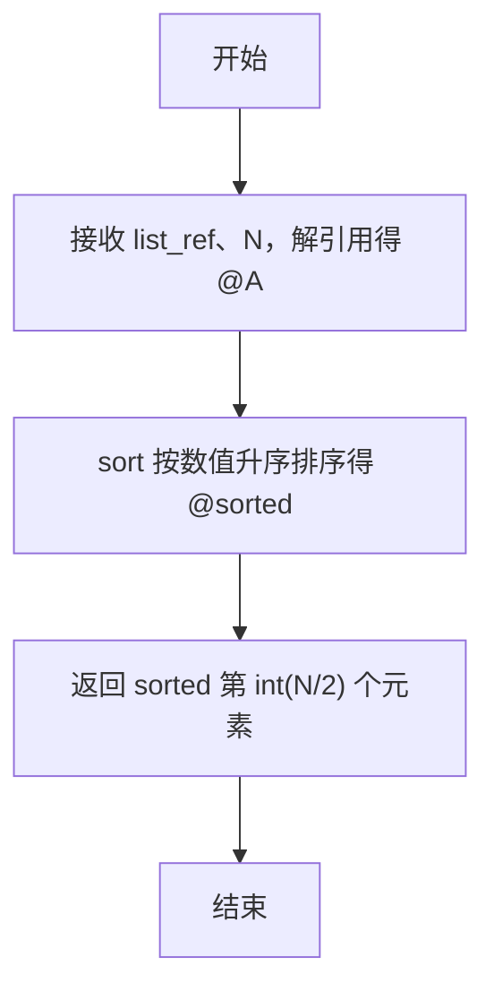
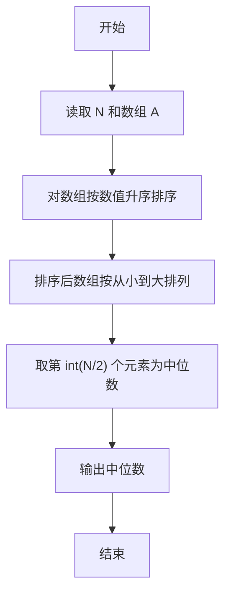

# PTA基础编程题目集 6-11求自定类型元素序列的中位数（Perl语言实现）

## 题目描述

本题要求实现一个函数，求N个集合元素A[]的中位数，即序列中第⌊(N+1)/2⌋大的元素。其中集合元素的类型为自定义的ElementType。

### 函数接口定义

```perl
sub Median {
    my ($list_ref, $N) = @_;   # 返回 list 中前 N 个元素的中位数
}
```

其中给定集合元素存放在数组A[]中，正整数N是数组元素个数。该函数须返回N个A[]元素的中位数，其值也必须是ElementType类型。

### 裁判测试程序样例

```perl
sub Median {
    my ($list_ref, $N) = @_;
    # 你的代码将被嵌在这里
}

my $N = <STDIN>;
chomp $N;
my $line = <STDIN>;
chomp $line;
my @list = split /\s+/, $line;
printf "%.2f\n", Median(\@list, $N);
```

### 输入样例

```in
3
12.3 34 -5
```

### 输出样例

```out
12.30
```

## 解题思路

这道题的核心是**排序后按下标取中位数**：中位数定义为排序后位于第 ⌊(N+1)/2⌋ 大的元素，先把数组按数值升序排序，再根据下标公式 `int($N / 2)` 直接取出中位数。

### 核心问题分析

1. **数值排序**：用 `sort { $a <=> $b } @A` 按数值大小升序排序得到 `@sorted`，注意 Perl 的 sort 默认按字符串比较，必须使用数值比较块 `$a <=> $b`。
2. **中位数下标**：下标从 0 开始，第 `int($N / 2)` 个元素即第 ⌊(N+1)/2⌋ 大元素。
3. **直接返回**：返回 `$sorted[int($N / 2)]` 即为中位数。

### 算法原理说明

中位数定义为排序后位于第 ⌊(N+1)/2⌋ 大的元素。思路：先把数组解引用到 `@A`，用 `sort { $a <=> $b }` 按数值大小升序排序得到 `@sorted`，再根据下标公式 `int($N / 2)` 直接取出中位数（下标从 0 开始，第 int(N/2) 个元素即第 ⌊(N+1)/2⌋ 大元素）。注意 Perl 的 sort 默认按字符串比较，必须使用数值比较块 `$a <=> $b`。

### 具体计算步骤

1. 函数 Median 通过 `my ($list_ref, $N) = @_` 接收数组引用和元素个数，`my @A = @$list_ref` 解引用得到数组。
2. 用 `sort { $a <=> $b } @A` 对数组按数值升序排序，结果存入 `@sorted`。
3. 返回 `$sorted[int($N / 2)]`，即中位数。

## 完整代码

```perl
use strict;
use warnings;

# 6-11 求自定类型元素序列的中位数
# 实现：数值排序后取第⌊(N+1)/2⌋大元素（下标 int(N/2)），仅取前 N 个元素排序
sub Median {
    my ($list_ref, $N) = @_;
    my @A = @{$list_ref};
    my @sorted = sort { $a <=> $b } @A[0 .. $N - 1];
    return $sorted[int($N / 2)];
}

chomp(my $N = <STDIN>);
chomp(my $line = <STDIN>);
my @list = split /\s+/, $line;
printf "%.2f\n", Median(\@list, $N);
```

## 代码流程说明

1. 函数 Median 通过 `my ($list_ref, $N) = @_` 接收数组引用和元素个数，`my @A = @$list_ref` 解引用得到数组。
2. 用 `sort { $a <=> $b } @A` 对数组按数值升序排序，结果存入 `@sorted`。
3. 返回 `$sorted[int($N / 2)]`，即中位数。

## 代码流程图



## 解题流程图



## 复杂度分析

设参与计算的元素个数为 N：

- 时间复杂度：`O(N log N)`，主要开销来自对前 N 个元素进行数值排序。
- 空间复杂度：`O(N)`，当前实现保存了数组副本和排序结果。

## 常见易错点

1. 必须使用 `sort { $a <=> $b }` 进行数值排序，不能使用默认的字符串排序。
2. Perl 数组下标从 0 开始，中位数下标应为 `int($N / 2)`。
3. 只能对前 N 个元素排序，不能无视题目给出的元素个数。
4. 函数返回数值即可，保留两位小数由裁判程序完成。
