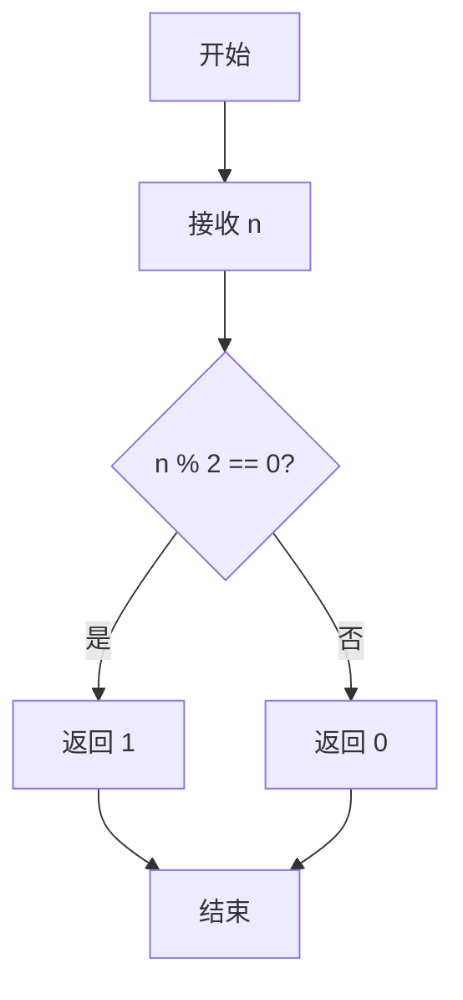
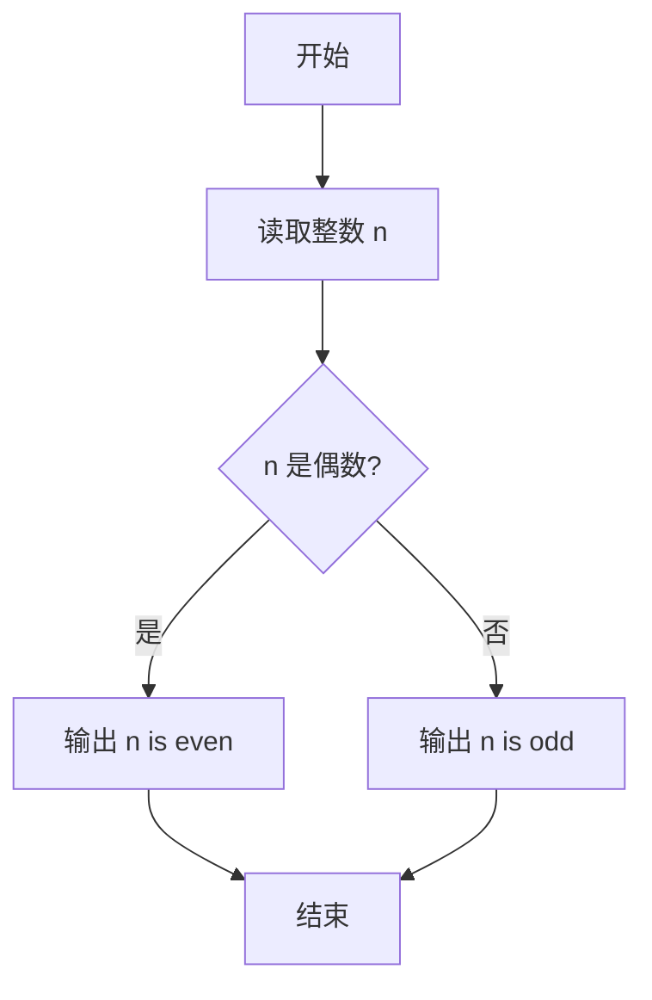

# PTA基础编程题目集 6-12判断奇偶性（Perl语言实现）

## 题目描述

本题要求实现判断给定整数奇偶性的函数。

### 函数接口定义

```perl
sub even {
    my ($n) = @_;   # n 为偶数时返回 1，n 为奇数时返回 0
}
```

其中`n`是用户传入的整型参数。当`n`为偶数时，函数返回1；`n`为奇数时返回0。注意：0是偶数。

### 裁判测试程序样例

```perl
sub even {
    my ($n) = @_;
    # 你的代码将被嵌在这里
}

my $n = <STDIN>;
chomp $n;
if (even($n)) {
    print "$n is even.\n";
} else {
    print "$n is odd.\n";
}
```

### 输入样例1

```in
-6
```

### 输出样例1

```out
-6 is even.
```

### 输入样例2

```in
5
```

### 输出样例2

```out
5 is odd.
```

## 解题思路

这道题的核心是**取模判断奇偶性**：只需看 `$n` 是否能被 2 整除——`$n % 2 == 0` 说明是偶数，否则是奇数，并按题目约定用三目表达式返回 1 或 0。

### 核心问题分析

1. **取模运算**：`$n % 2` 的余数为 0 表示偶数，为 1 表示奇数。
2. **返回值约定**：题目约定偶数返回 1、奇数返回 0，可用三目表达式 `$n % 2 == 0 ? 1 : 0` 一次判断完成。
3. **边界情况**：0 也是偶数，能被 `$n % 2 == 0` 条件正确判定；负数同样适用。

### 算法原理说明

判断奇偶性只需看 `$n` 是否能被 2 整除：`$n % 2 == 0` 说明是偶数，否则是奇数。题目约定偶数返回 1、奇数返回 0，因此用三目表达式 `$n % 2 == 0 ? 1 : 0` 判断即可，注意 0 也是偶数，能被该条件正确判定。

### 具体计算步骤

1. 函数 even 通过 `my ($n) = @_` 接收参数。
2. 计算 `$n % 2`。
3. 三目判断 `$n % 2 == 0`：成立（偶数）返回 1，不成立（奇数）返回 0。

## 完整代码

```perl
use strict;
use warnings;

# 6-12 判断奇偶性
# 实现：取模判断，偶数 1 奇数 0，0 为偶数，负数兼容
sub even {
    my ($n) = @_;
    return $n % 2 == 0 ? 1 : 0;
}

chomp(my $n = <STDIN>);
if (even($n)) {
    print "$n is even.\n";
} else {
    print "$n is odd.\n";
}
```

## 代码流程说明

1. 函数 even 通过 `my ($n) = @_` 接收参数。
2. 计算 `$n % 2`。
3. 三目判断 `$n % 2 == 0`：成立（偶数）返回 1，不成立（奇数）返回 0。

## 代码流程图



## 解题流程图



## 复杂度分析

- 时间复杂度：`O(1)`，只进行一次取模判断。
- 空间复杂度：`O(1)`，不需要额外存储。

## 常见易错点

1. 函数应返回 1 或 0，`n is even/odd` 由裁判程序负责输出。
2. 0 是偶数，`0 % 2 == 0` 可以正确处理这个边界。
3. 负数同样可以通过 `$n % 2 == 0` 判断，不能只接受非负数。
4. 应使用数值取模，不要用字符串操作判断末位字符。
