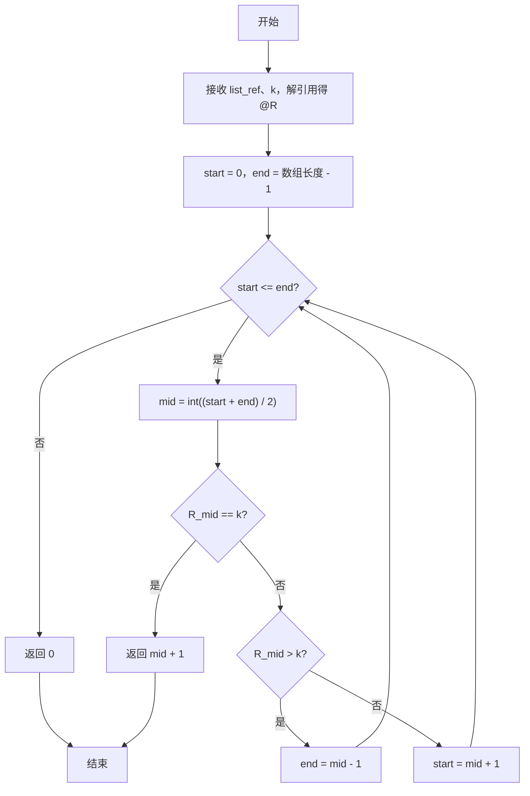
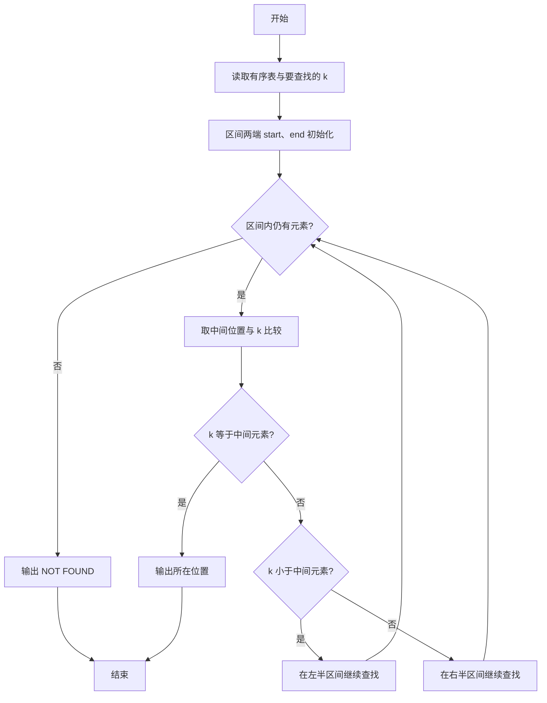

# PTA基础编程题目集 6-13折半查找（Perl语言实现）

## 题目描述

给一个严格递增数列，函数int Search_Bin(SSTable T, KeyType k)用来二分地查找k在数列中的位置。

### 函数接口定义

```perl
# 有序表用数组模拟：数组元素依次为表内元素值，下标从 0 开始
sub Search_Bin {
    my ($list_ref, $k) = @_;   # $list_ref 为有序表（数组引用），二分查找 k 的位置
}
```

### 裁判测试程序样例

```perl
sub Search_Bin {
    my ($list_ref, $k) = @_;
    # 你的代码将被嵌在这里
}

my $n = <STDIN>;
chomp $n;
my $line = <STDIN>;
chomp $line;
my @list = split /\s+/, $line;
my $k = <STDIN>;
chomp $k;
print Search_Bin(\@list, $k), "\n";
```


### 输入样例

```in
5
1 3 5 7 9
7
```

### 输出样例

```out
4
```

## 解题思路

这道题的核心是**二分查找**：利用有序表的有序性，不断把查找区间折半，通过比较中间元素与 k 的大小关系决定继续在左半区还是右半区查找，直到找到或区间为空。

### 核心问题分析

1. **区间初始化**：用 `$start`、`$end` 指向区间两端，初始为数组首尾下标。
2. **中间位置比较**：取中间位置 `$mid = int(($start + $end) / 2)` 与 `$k` 比较——相等则找到，返回 `$mid + 1`（题目要求 1-based 位置）。
3. **区间收窄**：`$R[$mid] > $k` 说明目标在左半区，把 `$end` 移到 `$mid - 1`；否则目标在右半区，把 `$start` 移到 `$mid + 1`。当 `$start > $end` 时区间为空，返回 0 表示未找到。

### 算法原理说明

二分查找适用于有序表，核心思路是不断把查找区间折半：用 `$start`、`$end` 指向区间两端，取中间位置 `$mid = int(($start + $end) / 2)` 与 `$k` 比较——相等则找到，返回 `$mid + 1`（题目要求 1-based 位置）；`$R[$mid] > $k` 说明目标在左半区，把 `$end` 移到 `$mid - 1`；否则目标在右半区，把 `$start` 移到 `$mid + 1`。当 `$start > $end` 时区间为空，返回 0 表示未找到。

### 具体计算步骤

1. 函数 Search_Bin 通过 `my ($list_ref, $k) = @_` 接收有序表引用和查找值，`my @R = @$list_ref` 解引用得到数组。
2. 初始化查找区间 `$start = 0`，`$end = scalar(@R) - 1`。
3. `while ($start <= $end)` 循环：区间非空时继续查找。
4. 取中间位置 `$mid = int(($start + $end) / 2)`。
5. 若 `$R[$mid] == $k`，`return $mid + 1`（找到，1-based 位置）。
6. 若 `$R[$mid] > $k`，`$end = $mid - 1` 在左半区继续；否则 `$start = $mid + 1` 在右半区继续。
7. 循环结束仍未找到，`return 0`。

## 完整代码

```perl
use strict;
use warnings;

# 6-13 折半查找
# 实现：二分查找，返回 1 起位置，未找到返回 0（严格递增有序表）
sub Search_Bin {
    my ($list_ref, $k) = @_;
    my @R = @{$list_ref};
    my $start = 0;
    my $end = scalar(@R) - 1;
    while ($start <= $end) {
        my $mid = int(($start + $end) / 2);
        if ($R[$mid] == $k) {
            return $mid + 1;
        } elsif ($R[$mid] > $k) {
            $end = $mid - 1;
        } else {
            $start = $mid + 1;
        }
    }
    return 0;
}

# 读入：第一行为长度 n，第二行为有序表，第三行为待查值 k，兼容多行合并
my $all = do { local $/; <STDIN> };
my @tok = split /\s+/, $all // "";
if (@tok) {
    my $n = shift @tok;
    my @arr = splice @tok, 0, $n;
    my $k = shift @tok;
    my $pos = Search_Bin(\@arr, $k);
    if ($pos == 0) {
        print "NOT FOUND\n";
    } else {
        print "$pos\n";
    }
}
```

## 代码流程说明

1. 函数 Search_Bin 通过 `my ($list_ref, $k) = @_` 接收有序表引用和查找值，`my @R = @$list_ref` 解引用得到数组。
2. 初始化查找区间 `$start = 0`，`$end = scalar(@R) - 1`。
3. `while ($start <= $end)` 循环：区间非空时继续查找。
4. 取中间位置 `$mid = int(($start + $end) / 2)`。
5. 若 `$R[$mid] == $k`，`return $mid + 1`（找到，1-based 位置）。
6. 若 `$R[$mid] > $k`，`$end = $mid - 1` 在左半区继续；否则 `$start = $mid + 1` 在右半区继续。
7. 循环结束仍未找到，`return 0`。

## 代码流程图



## 解题流程图



## 复杂度分析

设有序表中包含 N 个元素：

- 时间复杂度：`O(log N)`，每次比较后将候选区间缩小约一半。
- 空间复杂度：`O(N)`，当前实现将数组引用复制到 `@R`；若直接通过引用访问，额外空间可降为 `O(1)`。

## 常见易错点

1. 找到数组下标 `$mid` 后应返回 `$mid + 1`，因为题目位置从 1 开始。
2. 更新区间时要使用 `$mid - 1` 或 `$mid + 1`，避免重复检查中点导致死循环。
3. 未找到时返回 0，不要把数组下标 0 当作有效位置。
4. 二分查找依赖严格递增的有序表，不能直接用于无序数组。
