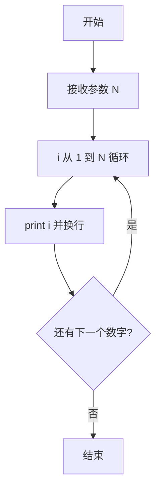
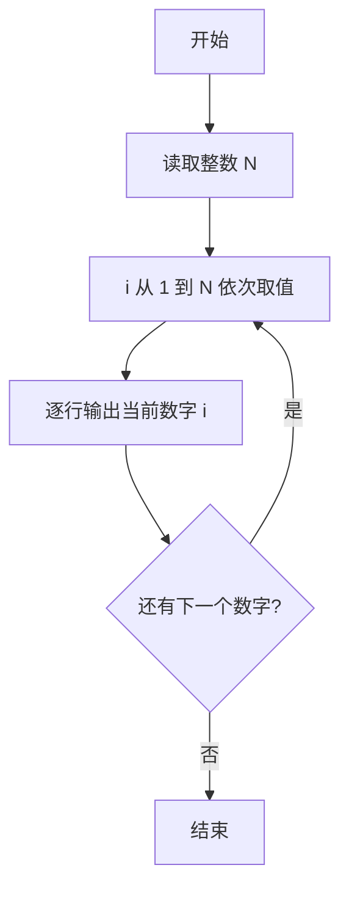

# PTA基础编程题目集 6-1简单输出整数（Perl语言实现）

## 题目描述

本题要求实现一个函数，对给定的正整数`N`，打印从1到`N`的全部正整数。

### 函数接口定义

```perl
sub PrintN {
    my ($N) = @_;   # 将 1 到 N 的全部正整数顺序打印，每个数字占 1 行
}
```

其中`N`是用户传入的参数。该函数必须将从1到`N`的全部正整数顺序打印出来，每个数字占1行。

### 裁判测试程序样例

```perl
sub PrintN {
    my ($N) = @_;
    # 你的代码将被嵌在这里
}

my $N = <STDIN>;
chomp $N;
PrintN($N);
```

### 输入样例

```in
3
```

### 输出样例

```out
1
2
3
```

## 解题思路

这道题的核心是**顺序输出整数序列**：函数收到参数 N 后，把 1 到 N 的每个整数按行打印出来，不需要返回值。

### 核心问题分析

1. **输出范围**：从 1 到 N 共 N 个正整数，必须按升序全部输出。
2. **输出格式**：每个数字占 1 行，即每次打印后都要换行。
3. **无需返回值**：函数只负责打印，不做任何计算和返回。

### 算法原理说明

最直接的做法是用 for 循环让循环变量 `$i` 从 1 递增到 N，每轮循环调用 `print "$i\n"` 将当前数字输出为单独一行，循环结束即完成全部输出。Perl 的范围操作符 `..` 可直接生成 1 到 N 的整数序列。

### 具体计算步骤

1. 函数 PrintN 通过 `my ($N) = @_` 接收参数 N。
2. `for my $i (1 .. $N)` 让 `$i` 从 1 遍历到 N。
3. 每轮循环体内 `print "$i\n"` 输出当前数字并换行。
4. 循环结束即完成全部输出。

## 完整代码

```perl
use strict;
use warnings;

# 6-1 简单输出整数
# 实现：依次打印 1..N，每行一个数
sub PrintN {
    my ($N) = @_;
    for my $i (1 .. $N) {
        print "$i\n";
    }
}

chomp(my $N = <STDIN>);
PrintN($N);
```

## 代码流程说明

1. 函数 PrintN 通过 `my ($N) = @_` 接收参数 N。
2. `for my $i (1 .. $N)` 让 `$i` 从 1 遍历到 N。
3. 每轮循环体内 `print "$i\n"` 输出当前数字并换行。
4. 循环结束即完成全部输出。

## 代码流程图



## 解题流程图


