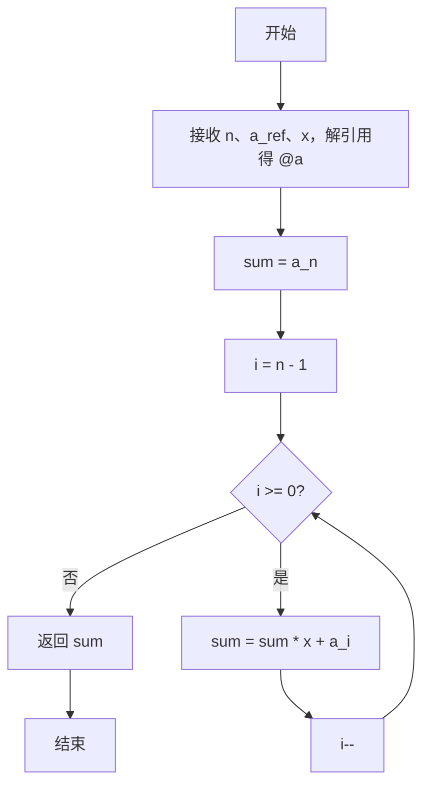
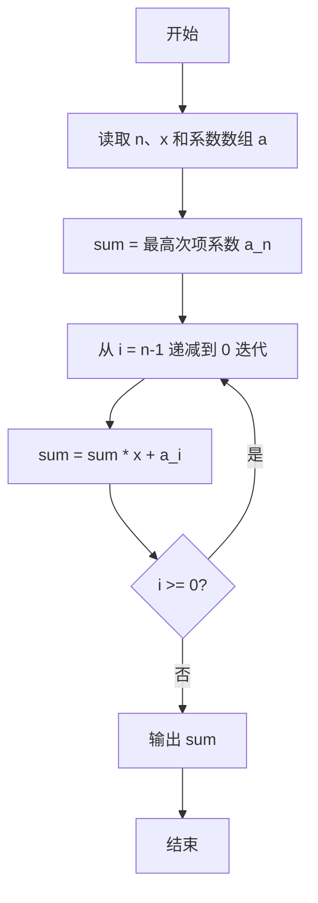

# PTA基础编程题目集 6-2多项式求值（Perl语言实现）

## 题目描述

本题要求实现一个函数，计算阶数为`n`，系数为`a[0]` ... `a[n]`的多项式*f*(*x*)=∑^n^~i=0~*(*a*[*i*]*×x^i^) 在`x`点的值。

### 函数接口定义

```perl
sub f {
    my ($n, $a_ref, $x) = @_;   # $a_ref 为系数数组引用，返回多项式 f(x) 的值
}
```

其中`n`是多项式的阶数，`a[]`中存储系数，`x`是给定点。函数须返回多项式`f(x)`的值。

### 裁判测试程序样例

```perl
sub f {
    my ($n, $a_ref, $x) = @_;
    # 你的代码将被嵌在这里
}

my $line = <STDIN>;
chomp $line;
my ($n, $x) = split /\s+/, $line;
my $line2 = <STDIN>;
chomp $line2;
my @a = split /\s+/, $line2;
printf "%.1f\n", f($n, \@a, $x);
```

### 输入样例

```in
2 1.1
1 2.5 -38.7
```

### 输出样例

```out
-43.1
```

## 解题思路

这道题的核心是**霍纳法则（秦九韶算法）**：把 f(x) = a[0] + a[1]·x + ... + a[n]·x^n 改写成从最高次项开始反复"乘 x 加系数"的递推形式，只需 O(n) 次乘法即可求出多项式值。

### 核心问题分析

1. **多项式改写**：f(x) 可改写成 a[0] + x(a[1] + x(a[2] + ... + x(a[n])...)) 的嵌套形式，从最内层开始逐层展开。
2. **迭代起点**：令 `$sum = $a[$n]`（最高次项系数），然后 `$i` 从 n-1 递减到 0，每轮执行 `$sum = $sum * $x + $a[$i]`。
3. **复杂度**：全程只需要 n 次乘法和 n 次加法，时间复杂度 O(n)，比直接逐项计算 x 的幂次高效得多。

### 算法原理说明

多项式求值采用**霍纳法则**（秦九韶算法）：把 f(x) = a[0] + a[1]·x + ... + a[n]·x^n 改写成从最高次项开始反复"乘 x 加系数"的递推形式。代码先令 `$sum = $a[$n]`（最高次项系数），然后 `$i` 从 n-1 递减到 0，每轮执行 `$sum = $sum * $x + $a[$i]`，最终 `$sum` 即为多项式在 x 点的值，只需 O(n) 次乘法。

### 具体计算步骤

1. 函数 f 通过 `my ($n, $a_ref, $x) = @_` 接收参数，`my @a = @$a_ref` 解引用得到系数数组。
2. 初始化 `$sum = $a[$n]`，即最高次项系数。
3. `for (my $i = $n - 1; $i >= 0; $i--)` 让 `$i` 从 n-1 递减到 0。
4. 每轮执行 `$sum = $sum * $x + $a[$i]`，按霍纳法则累乘累加。
5. 循环结束后 `return $sum` 返回多项式值。

## 完整代码

```perl
use strict;
use warnings;

# 6-2 多项式求值
# 实现：霍纳法则迭代求值，O(n) 时间，兼容直接幂次法
sub f {
    my ($n, $a_ref, $x) = @_;
    my @a = @{$a_ref};
    my $sum = $a[$n];
    for (my $i = $n - 1; $i >= 0; $i--) {
        $sum = $sum * $x + $a[$i];
    }
    return $sum;
}

chomp(my $line = <STDIN>);
my ($n, $x) = split /\s+/, $line;
chomp(my $line2 = <STDIN>);
my @a = split /\s+/, $line2;
printf "%.1f\n", f($n, \@a, $x);
```

## 代码流程说明

1. 函数 f 通过 `my ($n, $a_ref, $x) = @_` 接收参数，`my @a = @$a_ref` 解引用得到系数数组。
2. 初始化 `$sum = $a[$n]`，即最高次项系数。
3. `for (my $i = $n - 1; $i >= 0; $i--)` 让 `$i` 从 n-1 递减到 0。
4. 每轮执行 `$sum = $sum * $x + $a[$i]`，按霍纳法则累乘累加。
5. 循环结束后 `return $sum` 返回多项式值。

## 代码流程图



## 解题流程图


