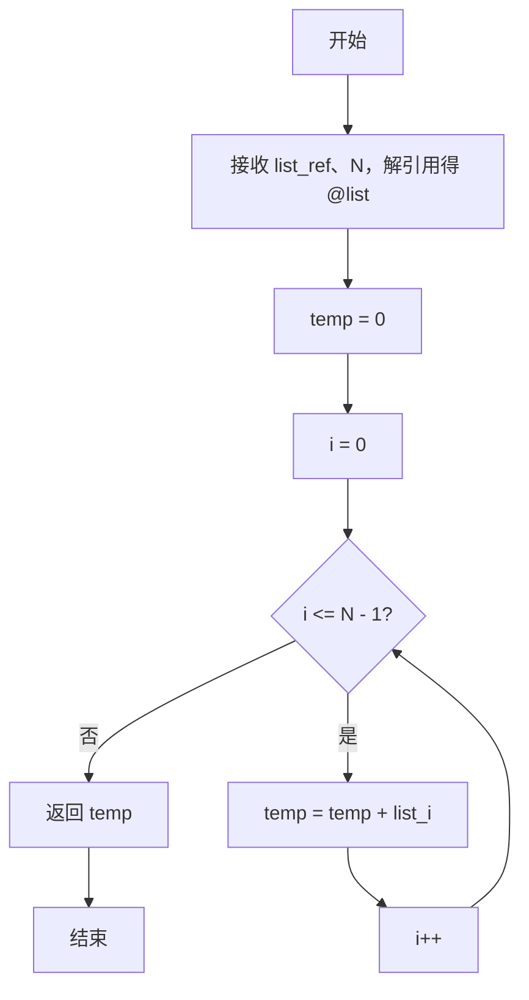
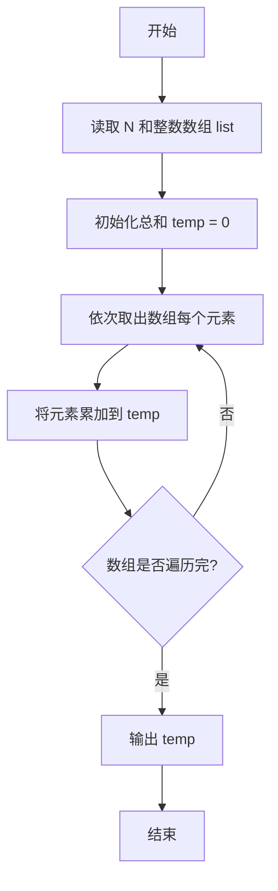

# PTA基础编程题目集 6-3简单求和（Perl语言实现）

## 题目描述

本题要求实现一个函数，求给定的`N`个整数的和。

### 函数接口定义

```perl
sub Sum {
    my ($list_ref, $N) = @_;   # 返回 list 中前 N 个元素的和
}
```

其中给定整数存放在数组`List[]`中，正整数`N`是数组元素个数。该函数须返回`N`个`List[]`元素的和。

### 裁判测试程序样例

```perl
sub Sum {
    my ($list_ref, $N) = @_;
    # 你的代码将被嵌在这里
}

my $N = <STDIN>;
chomp $N;
my $line = <STDIN>;
chomp $line;
my @list = split /\s+/, $line;
print Sum(\@list, $N), "\n";
```

### 输入样例

```in
3
12 34 -5
```

### 输出样例

```out
41
```

## 解题思路

这道题的核心是**累加求和**：用变量 `$temp` 保存累加结果（初始为 0），遍历数组 `@list` 的每个元素，依次把元素值累加到 `$temp` 中，遍历结束后 `$temp` 就是所有 N 个整数的和。

### 核心问题分析

1. **累加变量初始化**：`$temp = 0`，保证从零开始累加。
2. **遍历累加**：用 for 循环遍历数组下标 0 到 N-1，每轮把 `$list[$i]` 累加进 `$temp`。
3. **返回结果**：循环结束后 `return $temp`，即为 N 个整数的总和。

### 算法原理说明

求和的核心思路是：用变量 `$temp` 保存累加结果（初始为 0），遍历数组 `@list` 的每个元素，依次把元素值累加到 `$temp` 中。遍历结束后 `$temp` 就是所有 N 个整数的和。

### 具体计算步骤

1. 函数 Sum 通过 `my ($list_ref, $N) = @_` 接收数组引用和元素个数，`my @list = @$list_ref` 解引用得到数组。
2. 初始化 `$temp = 0`。
3. `for my $i (0 .. $N - 1)` 遍历数组下标。
4. 每轮执行 `$temp += $list[$i]`，把当前元素加入总和。
5. 循环结束后 `return $temp` 返回总和。

## 完整代码

```perl
use strict;
use warnings;

# 6-3 简单求和
# 实现：线性累加求和
sub Sum {
    my ($list_ref, $N) = @_;
    my @list = @{$list_ref};
    my $temp = 0;
    for my $i (0 .. $N - 1) {
        $temp += $list[$i];
    }
    return $temp;
}

chomp(my $N = <STDIN>);
chomp(my $line = <STDIN>);
my @list = split /\s+/, $line;
print Sum(\@list, $N), "\n";
```

## 代码流程说明

1. 函数 Sum 通过 `my ($list_ref, $N) = @_` 接收数组引用和元素个数，`my @list = @$list_ref` 解引用得到数组。
2. 初始化 `$temp = 0`。
3. `for my $i (0 .. $N - 1)` 遍历数组下标。
4. 每轮执行 `$temp += $list[$i]`，把当前元素加入总和。
5. 循环结束后 `return $temp` 返回总和。

## 代码流程图



## 解题流程图


