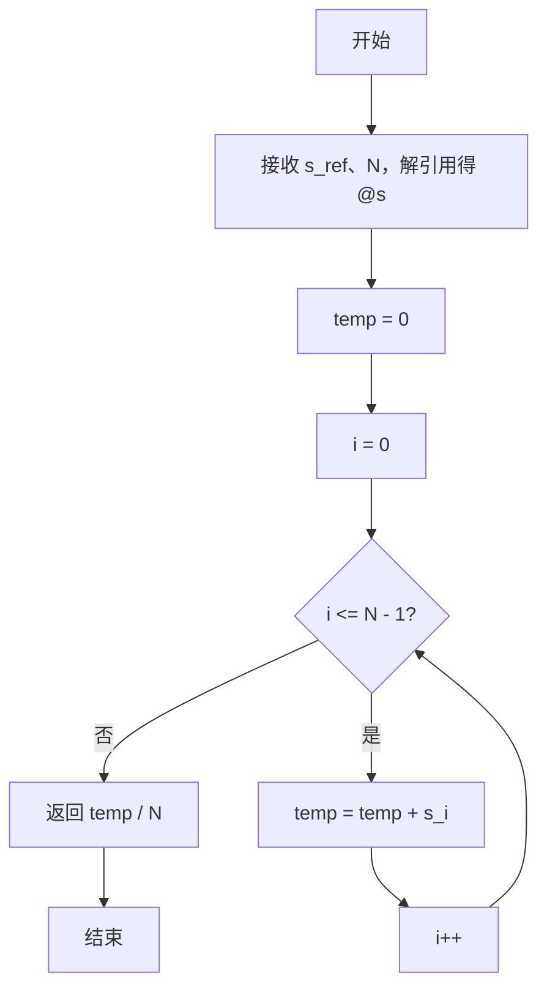
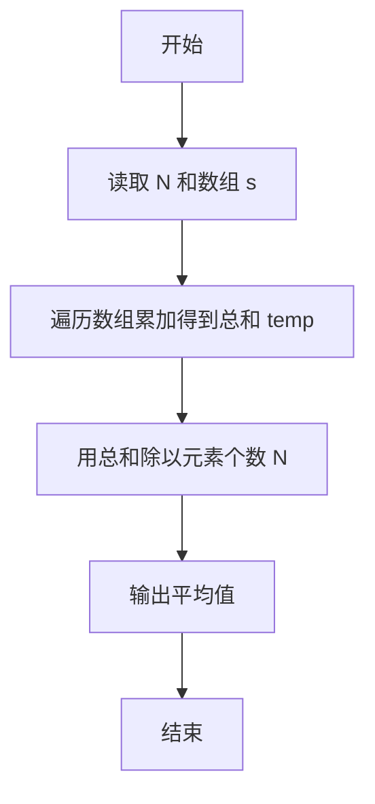

# PTA基础编程题目集 6-4求自定类型元素的平均（Perl语言实现）

## 题目描述

本题要求实现一个函数，求`N`个集合元素`S[]`的平均值，其中集合元素的类型为自定义的`ElementType`。

### 函数接口定义

```perl
sub Average {
    my ($list_ref, $N) = @_;   # 返回 list 中前 N 个元素的平均值
}
```

其中给定集合元素存放在数组`S[]`中，正整数`N`是数组元素个数。该函数须返回`N`个`S[]`元素的平均值，其值也必须是`ElementType`类型。

### 裁判测试程序样例

```perl
sub Average {
    my ($list_ref, $N) = @_;
    # 你的代码将被嵌在这里
}

my $N = <STDIN>;
chomp $N;
my $line = <STDIN>;
chomp $line;
my @list = split /\s+/, $line;
printf "%.2f\n", Average(\@list, $N);
```

### 输入样例

```in
3
12.3 34 -5
```

### 输出样例

```out
13.77
```

## 解题思路

这道题的核心是**求和后取平均**：平均值 = 元素总和 ÷ 元素个数。先遍历数组把全部元素累加得到总和 `$temp`，再用 `$temp` 除以元素个数 `$N` 即可得到平均值。

### 核心问题分析

1. **累加总和**：用变量 `$temp` 从 0 开始，遍历数组下标 0 到 N-1，把每个元素累加进去。
2. **除以个数**：用总和 `$temp` 除以元素个数 `$N`，得到平均值。
3. **浮点除法**：Perl 中除法运算符 `/` 会自动得到浮点数结果，因此直接返回 `$temp / $N` 即为平均值。

### 算法原理说明

平均值 = 元素总和 ÷ 元素个数。思路是先遍历数组 `@s` 把全部元素累加得到总和 `$temp`，再用 `$temp` 除以元素个数 `$N`。Perl 中除法运算符 `/` 会自动得到浮点数结果，因此直接返回 `$temp / $N` 即为平均值。

### 具体计算步骤

1. 函数 Average 通过 `my ($s_ref, $N) = @_` 接收数组引用和元素个数，`my @s = @$s_ref` 解引用得到数组。
2. 初始化 `$temp = 0`。
3. `for my $i (0 .. $N - 1)` 遍历数组，把每个元素累加到 `$temp`。
4. 返回 `$temp / $N`，即平均值。

## 完整代码

```perl
use strict;
use warnings;

# 6-4 求自定类型元素的平均
# 实现：先累加再除以 N
sub Average {
    my ($list_ref, $N) = @_;
    my @s = @{$list_ref};
    my $temp = 0;
    for my $i (0 .. $N - 1) {
        $temp += $s[$i];
    }
    return $temp / $N;
}

chomp(my $N = <STDIN>);
chomp(my $line = <STDIN>);
my @list = split /\s+/, $line;
printf "%.2f\n", Average(\@list, $N);
```

## 代码流程说明

1. 函数 Average 通过 `my ($s_ref, $N) = @_` 接收数组引用和元素个数，`my @s = @$s_ref` 解引用得到数组。
2. 初始化 `$temp = 0`。
3. `for my $i (0 .. $N - 1)` 遍历数组，把每个元素累加到 `$temp`。
4. 返回 `$temp / $N`，即平均值。

## 代码流程图



## 解题流程图


