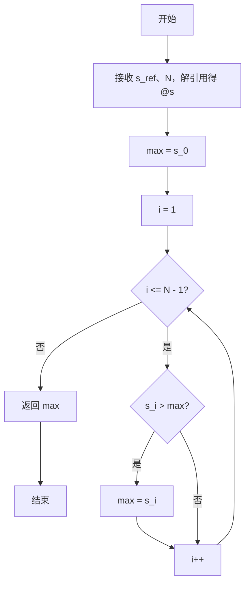
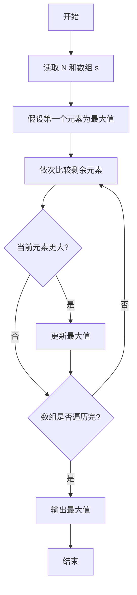

# PTA基础编程题目集 6-5求自定类型元素的最大值（Perl语言实现）

## 题目描述

本题要求实现一个函数，求`N`个集合元素`S[]`中的最大值，其中集合元素的类型为自定义的`ElementType`。

### 函数接口定义

```perl
sub Max {
    my ($list_ref, $N) = @_;   # 返回 list 中前 N 个元素的最大值
}
```

其中给定集合元素存放在数组`S[]`中，正整数`N`是数组元素个数。该函数须返回`N`个`S[]`元素中的最大值，其值也必须是`ElementType`类型。

### 裁判测试程序样例

```perl
sub Max {
    my ($list_ref, $N) = @_;
    # 你的代码将被嵌在这里
}

my $N = <STDIN>;
chomp $N;
my $line = <STDIN>;
chomp $line;
my @list = split /\s+/, $line;
printf "%.2f\n", Max(\@list, $N);
```

### 输入样例

```in
3
12.3 34 -5
```

### 输出样例

```out
34.00
```

## 解题思路

这道题的核心是**打擂台法求最大值**：先把第一个元素当作当前最大值，再从第二个元素开始依次与当前最大值比较，凡是更大的元素就更新当前最大值，遍历结束后即为整个数组的最大值。

### 核心问题分析

1. **初始最大值**：把首元素 `$s[0]` 当作当前最大值 `$max`，作为"擂台"上的初始值。
2. **遍历比较**：从第二个元素开始遍历，每轮判断 `$s[$i] > $max`，成立则更新 `$max`。
3. **返回结果**：循环结束后 `return $max`，即为 N 个元素中的最大值。

### 算法原理说明

求最大值采用"打擂台"思路：先把第一个元素 `$s[0]` 当作当前最大值 `$max`，然后从第二个元素开始依次与 `$max` 比较，凡是比 `$max` 大的元素就更新 `$max`（`$max = $s[$i] if $s[$i] > $max`）。遍历结束后 `$max` 即为整个数组的最大值。

### 具体计算步骤

1. 函数 Max 通过 `my ($s_ref, $N) = @_` 接收数组引用和元素个数，`my @s = @$s_ref` 解引用得到数组。
2. 初始化 `$max = $s[0]`，把首元素作为初始最大值。
3. `for my $i (1 .. $N - 1)` 从第二个元素开始遍历。
4. 每轮判断 `$s[$i] > $max`：成立则执行 `$max = $s[$i]` 更新最大值。
5. 循环结束后 `return $max` 返回最大值。

## 完整代码

```perl
use strict;
use warnings;

# 6-5 求自定类型元素的最大值
# 实现：打擂台法遍历求最大
sub Max {
    my ($list_ref, $N) = @_;
    my @s = @{$list_ref};
    my $max = $s[0];
    for my $i (1 .. $N - 1) {
        $max = $s[$i] if $s[$i] > $max;
    }
    return $max;
}

chomp(my $N = <STDIN>);
chomp(my $line = <STDIN>);
my @list = split /\s+/, $line;
printf "%.2f\n", Max(\@list, $N);
```

## 代码流程说明

1. 函数 Max 通过 `my ($s_ref, $N) = @_` 接收数组引用和元素个数，`my @s = @$s_ref` 解引用得到数组。
2. 初始化 `$max = $s[0]`，把首元素作为初始最大值。
3. `for my $i (1 .. $N - 1)` 从第二个元素开始遍历。
4. 每轮判断 `$s[$i] > $max`：成立则执行 `$max = $s[$i]` 更新最大值。
5. 循环结束后 `return $max` 返回最大值。

## 代码流程图



## 解题流程图


