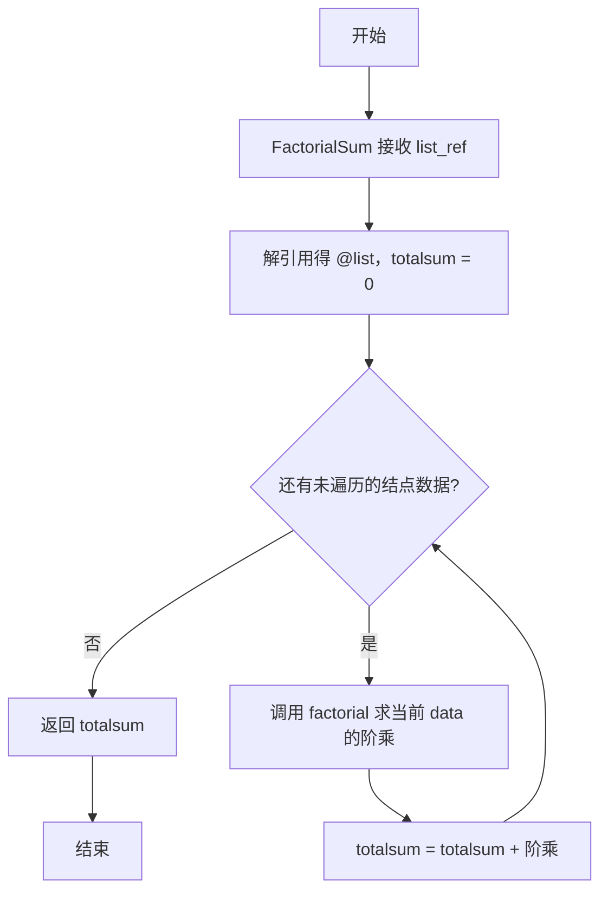
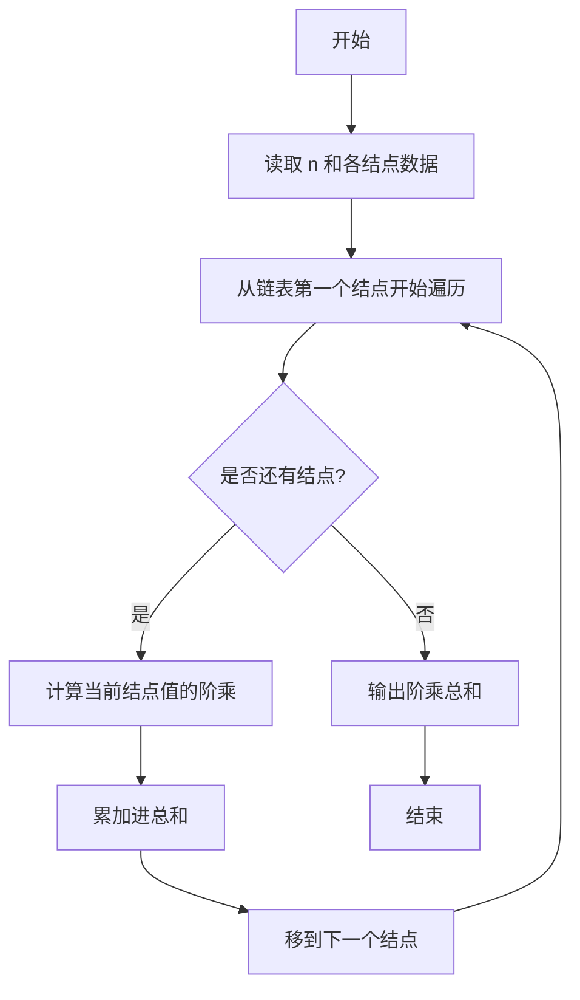

# PTA基础编程题目集 6-6求单链表结点的阶乘和（Perl语言实现）

## 题目描述

本题要求实现一个函数，求单链表`L`结点的阶乘和。这里默认所有结点的值非负，且题目保证结果在`int`范围内。

### 函数接口定义

```perl
sub FactorialSum {
    my ($list_ref) = @_;   # $list_ref 为链表（数组引用），求各结点值的阶乘和
}
```

其中单链表`List`的定义如下：

```perl
# 链表用数组模拟：数组元素依次为链表各结点的 Data 值
# 链表类型 List 即该数组的引用。
```


### 输入样例

```in
3
5 3 6
```

### 输出样例

```out
846
```

## 解题思路

这道题的核心是**逐结点求阶乘并累加**：先用辅助函数 `factorial` 计算单个值的阶乘，再在 `FactorialSum` 中遍历链表（数组）的每个结点数据，把每个结点值的阶乘累加进总和。

### 核心问题分析

1. **链表用数组模拟**：Perl 中没有指针链表，源数据用数组模拟——数组元素依次为链表各结点的 Data 值，链表类型 List 即该数组的引用。
2. **阶乘辅助函数**：`factorial($n)` 从 n 递减乘到 1，返回单个值的阶乘。
3. **遍历累加**：在 FactorialSum 中遍历数组 `@list`，对每个结点数据调用 `factorial($data)` 并累加到 `$totalsum`。

### 算法原理说明

题目要求求单链表中所有结点值的阶乘之和，链表在 Perl 中用数组模拟（数组元素依次为各结点的 Data 值）。思路：先用辅助函数 `factorial` 计算单个值的阶乘（从 n 递减乘到 1），再在 `FactorialSum` 中遍历数组 `@list`，对每个结点数据调用 `factorial($data)` 并累加到 `$totalsum`，链表遍历完毕后返回总和。

### 具体计算步骤

1. 辅助函数 factorial 接收 `$n`，初始化 `$sum = 1`。
2. `for (my $i = $n; $i >= 1; $i--)` 让 `$i` 从 n 递减到 1，每轮 `$sum *= $i`，返回阶乘结果。
3. 函数 FactorialSum 通过 `my ($list_ref) = @_` 接收链表（数组引用），`my @list = @$list_ref` 解引用得到结点数据数组。
4. 初始化 `$totalsum = 0`。
5. `for my $data (@list)` 遍历每个结点的数据，`$totalsum += factorial($data)` 累加阶乘。
6. 循环结束后 `return $totalsum` 返回阶乘和。

## 完整代码

```perl
use strict;
use warnings;

# 6-6 求单链表结点的阶乘和
# 实现：单链表用数组模拟；FactorialSum 遍历累加，空链表返回 0，0! =1
# 参考标准实现：辅助 factorial 内联或独立函数均可，确保非负且结果在 int 范围
sub factorial {
    my ($n) = @_;
    my $sum = 1;
    for (my $i = $n; $i >= 1; $i--) {
        $sum *= $i;
    }
    return $sum;
}

sub FactorialSum {
    my ($list_ref) = @_;
    my @list = @{$list_ref};
    my $totalsum = 0;
    for my $data (@list) {
        $totalsum += factorial($data);
    }
    return $totalsum;
}

chomp(my $N = <STDIN>);
my @vals;
if (defined $N && $N =~ /^\d+$/ && $N > 0) {
    my $rest = do { local $/; <STDIN> };
    @vals = split /\s+/, $rest // "";
    @vals = @vals[0 .. $N-1] if @vals >= $N;
}
print FactorialSum(\@vals), "\n";
```

## 代码流程说明

1. 辅助函数 factorial 接收 `$n`，初始化 `$sum = 1`。
2. `for (my $i = $n; $i >= 1; $i--)` 让 `$i` 从 n 递减到 1，每轮 `$sum *= $i`，返回阶乘结果。
3. 函数 FactorialSum 通过 `my ($list_ref) = @_` 接收链表（数组引用），`my @list = @$list_ref` 解引用得到结点数据数组。
4. 初始化 `$totalsum = 0`。
5. `for my $data (@list)` 遍历每个结点的数据，`$totalsum += factorial($data)` 累加阶乘。
6. 循环结束后 `return $totalsum` 返回阶乘和。

## 代码流程图



## 解题流程图


