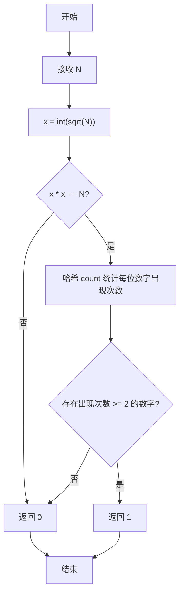
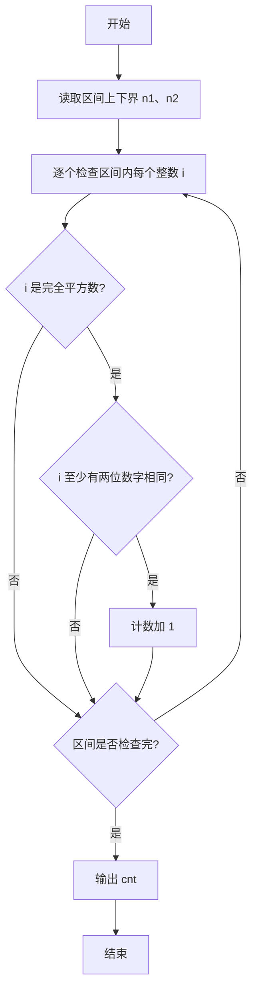

# PTA基础编程题目集 6-7统计某类完全平方数（Perl语言实现）

## 题目描述

本题要求实现一个函数，判断任一给定整数`N`是否满足条件：它是完全平方数，又至少有两位数字相同，如144、676等。

### 函数接口定义

```perl
sub IsTheNumber {
    my ($N) = @_;   # N 是完全平方数且至少两位数字相同返回 1，否则返回 0
}
```

其中`N`是用户传入的参数。如果`N`满足条件，则该函数必须返回1，否则返回0。

### 裁判测试程序样例

```perl
sub IsTheNumber {
    my ($N) = @_;
    # 你的代码将被嵌在这里
}

my $line = <STDIN>;
chomp $line;
my ($n1, $n2) = split /\s+/, $line;
my $cnt = 0;
for my $i ($n1 .. $n2) {
    $cnt++ if IsTheNumber($i);
}
print "cnt = $cnt\n";
```

### 输入样例

```in
105 500
```

### 输出样例

```out
cnt = 6
```

## 解题思路

这道题的核心是**双重条件判断**：题目要求同时满足两个条件——① 完全平方数；② 至少有两位数字相同。先验证完全平方数，再统计各位数字出现次数判断是否有重复数字。

### 核心问题分析

1. **完全平方数判断**：对 `$N` 开平方取整得到 `$x = int(sqrt($N))`，判断 `$x * $x == $N` 是否成立，不成立直接返回 0。
2. **逐位统计**：用哈希 `%count` 统计 `$N` 每一位数字的出现次数，`while ($M >= 10)` 循环中逐位取 `$M % 10` 计数并去掉最低位。
3. **重复数字判定**：遍历哈希的值，只要有任一数字出现次数 >= 2 即满足第二个条件，返回 1。

### 算法原理说明

思路分两步：先对 `$N` 开平方取整得到 `$x = int(sqrt($N))`，判断 `$x * $x == $N` 是否成立来验证完全平方数，不成立直接返回 0；再用哈希 `%count` 统计 `$N` 每一位数字的出现次数（`while ($M >= 10)` 循环中逐位取 `$M % 10` 计数并去掉最低位），最后遍历哈希的值，只要有任一数字出现次数 >= 2 即满足第二个条件，返回 1。

### 具体计算步骤

1. 函数 IsTheNumber 通过 `my ($N) = @_` 接收参数。
2. 计算 `$x = int(sqrt($N))`，若 `$x * $x != $N` 则 `return 0`（不是完全平方数）。
3. 初始化哈希 `%count`，`$M = $N`。
4. `while ($M >= 10)` 循环：`$count{$M % 10}++` 统计最低位，`$M = int($M / 10)` 去掉最低位。
5. 循环结束后 `$count{$M}++` 统计剩余的最高位。
6. `for my $c (values %count)` 检查各数字出现次数，若 `$c >= 2` 则 `return 1`。
7. 全部检查完仍无重复，`return 0`。

## 完整代码

```perl
use strict;
use warnings;

# 6-7 统计某类完全平方数
# 实现：负数与个位数特判 + 平方根邻近修正 + 哈希统计重复数字
sub IsTheNumber {
    my ($N) = @_;
    return 0 if $N < 0;
    return 0 if $N < 10;
    my $x = int(sqrt($N));
    $x++ while ($x + 1) * ($x + 1) <= $N;
    $x-- while $x * $x > $N;
    return 0 unless $x * $x == $N;
    my %count;
    my $M = $N;
    while ($M > 0) {
        $count{$M % 10}++;
        return 1 if $count{$M % 10} >= 2;
        $M = int($M / 10);
    }
    return 0;
}

chomp(my $line = <STDIN>);
my ($n1, $n2) = split /\s+/, $line;
my $cnt = 0;
for my $i ($n1 .. $n2) {
    $cnt++ if IsTheNumber($i);
}
print "cnt = $cnt\n";
```

## 代码流程说明

1. 函数 IsTheNumber 通过 `my ($N) = @_` 接收参数。
2. 计算 `$x = int(sqrt($N))`，若 `$x * $x != $N` 则 `return 0`（不是完全平方数）。
3. 初始化哈希 `%count`，`$M = $N`。
4. `while ($M >= 10)` 循环：`$count{$M % 10}++` 统计最低位，`$M = int($M / 10)` 去掉最低位。
5. 循环结束后 `$count{$M}++` 统计剩余的最高位。
6. `for my $c (values %count)` 检查各数字出现次数，若 `$c >= 2` 则 `return 1`。
7. 全部检查完仍无重复，`return 0`。

## 代码流程图



## 解题流程图



## 复杂度分析

设 N 的十进制位数为 d：

- 时间复杂度：`O(d)`，平方根判断为常数次运算，随后最多检查 N 的每一位，并遍历至多 10 个数字计数。
- 空间复杂度：`O(1)`，哈希表最多保存 10 个数字的出现次数。

## 常见易错点

1. 必须同时满足“完全平方数”和“至少两位数字相同”两个条件。
2. 负数不是合法的完全平方数，个位数也不可能出现两位相同。
3. 逐位循环结束后剩余的最高位仍要计数，不能只统计取模得到的低位。
4. 浮点平方根需要经过平方验证和邻近修正，不能只比较未经修正的平方根。
