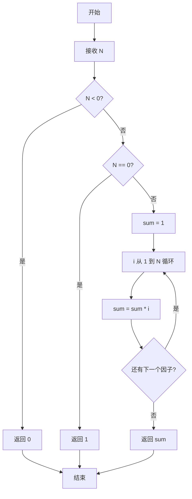
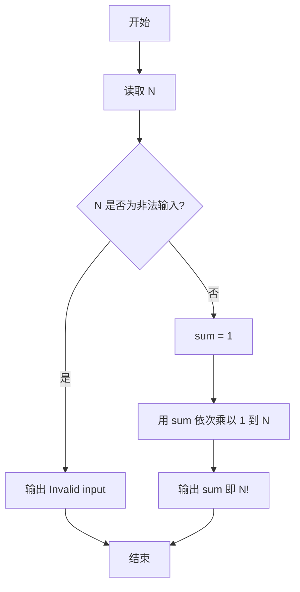

# PTA基础编程题目集 6-8简单阶乘计算（Perl语言实现）

## 题目描述

本题要求实现一个计算非负整数阶乘的简单函数。

### 函数接口定义

```perl
sub Factorial {
    my ($N) = @_;   # N 为非负整数时返回其阶乘，否则返回 0
}
```

其中`N`是用户传入的参数，其值不超过12。如果`N`是非负整数，则该函数必须返回`N`的阶乘，否则返回0。

### 裁判测试程序样例

```perl
sub Factorial {
    my ($N) = @_;
    # 你的代码将被嵌在这里
}

my $N = <STDIN>;
chomp $N;
my $NF = Factorial($N);
if ($NF) {
    printf "%d! = %d\n", $N, $NF;
} else {
    print "Invalid input\n";
}
```

### 输入样例

```in
5
```

### 输出样例

```out
5! = 120
```

## 解题思路

这道题的核心是**分情况迭代求阶乘**：先处理 `$N < 0` 的非法输入直接返回 0，再处理 `$N == 0` 时返回 1（0! = 1），否则用变量 `$sum` 从 1 开始依次乘以 1 到 N 的每个整数，最终得到 N 的阶乘。

### 核心问题分析

1. **非法输入处理**：`$N < 0` 不是非负整数，按题目约定直接 `return 0`。
2. **0! 特例**：`$N == 0` 时 0! = 1，需单独返回 1。
3. **迭代累乘**：初始化 `$sum = 1`，`for my $i (1 .. $N)` 每轮执行 `$sum *= $i`，循环结束后即得 N!。

### 算法原理说明

阶乘 N! = 1 × 2 × ... × N，且 0! = 1。思路：先判断 `$N < 0` 的非法输入，直接返回 0；`$N == 0` 时返回 1；否则用变量 `$sum` 从 1 开始，依次乘以 1 到 N 的每个整数，最终得到 N 的阶乘。

### 具体计算步骤

1. 判断 `$N < 0`：成立则 `return 0`（题目约定非法输入返回 0）。
2. 判断 `$N == 0`：成立则 `return 1`（0! = 1）。
3. 初始化 `$sum = 1`。
4. `for my $i (1 .. $N)` 循环，每轮执行 `$sum *= $i`。
5. 循环结束后 `return $sum`，即为 N!。

## 完整代码

```perl
use strict;
use warnings;

# 6-8 简单阶乘计算
# 实现：N<0 返回 0（Invalid input），N==0 返回 1，N≤12 迭代求阶乘
sub Factorial {
    my ($N) = @_;
    return 0 if $N < 0;
    return 1 if $N == 0;
    my $sum = 1;
    for my $i (1 .. $N) {
        $sum *= $i;
    }
    return $sum;
}

chomp(my $N = <STDIN>);
my $NF = Factorial($N);
if ($NF) {
    printf "%d! = %d\n", $N, $NF;
} else {
    print "Invalid input\n";
}
```

## 代码流程说明

1. 判断 `$N < 0`：成立则 `return 0`（题目约定非法输入返回 0）。
2. 判断 `$N == 0`：成立则 `return 1`（0! = 1）。
3. 初始化 `$sum = 1`。
4. `for my $i (1 .. $N)` 循环，每轮执行 `$sum *= $i`。
5. 循环结束后 `return $sum`，即为 N!。

## 代码流程图



## 解题流程图



## 复杂度分析

设输入 N 为非负整数：

- 时间复杂度：`O(N)`，从 1 到 N 依次完成累乘。
- 空间复杂度：`O(1)`，只保存当前阶乘结果和循环变量。

## 常见易错点

1. 负数是非法输入，应直接返回 0。
2. `0!` 等于 1，不能返回 0。
3. 阶乘结果应从 1 开始，若从 0 开始会使所有结果变为 0。
4. 裁判程序用返回值 0 识别非法输入，函数接口约定不能随意改变。
