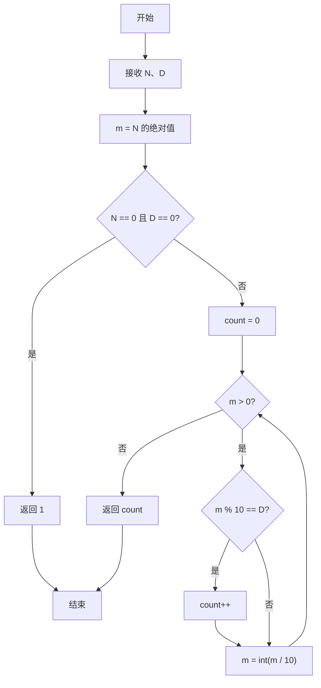
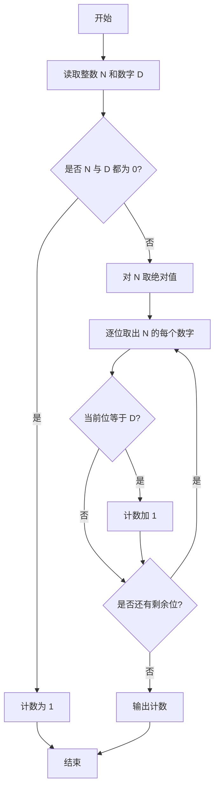

# PTA基础编程题目集 6-9统计个位数字（Perl语言实现）

## 题目描述

本题要求实现一个函数，可统计任一整数中某个位数出现的次数。例如-21252中，2出现了3次，则该函数应该返回3。

### 函数接口定义

```perl
sub Count_Digit {
    my ($N, $D) = @_;   # 返回整数 N 中数字 D 出现的次数
}
```

其中`N`和`D`都是用户传入的参数。`N`的值不超过`int`的范围；`D`是[0, 9]区间内的个位数。函数须返回`N`中`D`出现的次数。

### 裁判测试程序样例

```perl
sub Count_Digit {
    my ($N, $D) = @_;
    # 你的代码将被嵌在这里
}

my $line = <STDIN>;
chomp $line;
my ($N, $D) = split /\s+/, $line;
print Count_Digit($N, $D), "\n";
```

### 输入样例

```in
-21252 2
```

### 输出样例

```out
3
```

## 解题思路

这道题的核心是**逐位统计数字出现次数**：先对负数取绝对值，再通过反复取最低位并与目标数字比较来计数，同时要注意 `$N` 与 `$D` 都为 0 的边界情况。

### 核心问题分析

1. **负数处理**：先对负数取绝对值存入 `$m`（`$m = $N < 0 ? -$N : $N`），保证逐位统计的正确性。
2. **逐位统计**：每次用 `$m % 10` 取出当前最低位与 `$D` 比较，相等则 `$count++`，再用 `$m = int($m / 10)` 去掉该位，直到 `$m` 变为 0。
3. **边界情况**：`$N` 和 `$D` 都为 0 时，0 中数字 0 出现 1 次，需单独 `return 1`。

### 算法原理说明

统计数字 `$D` 在整数 `$N` 中出现的次数，核心是逐位检查：先对负数取绝对值存入 `$m`（`$m = $N < 0 ? -$N : $N`）；每次用 `$m % 10` 取出当前最低位与 `$D` 比较，相等则 `$count++`，再用 `$m = int($m / 10)` 去掉该位，直到 `$m` 变为 0。需要注意特殊边界：`$N` 和 `$D` 都为 0 时，0 中数字 0 出现 1 次，需单独返回 1。

### 具体计算步骤

1. 函数 Count_Digit 通过 `my ($N, $D) = @_` 接收参数。
2. 计算 `$m = $N < 0 ? -$N : $N`，对负数取绝对值。
3. 特例：`$N == 0 && $D == 0` 时 `return 1`。
4. 初始化计数 `$count = 0`。
5. `while ($m)` 循环：`$m % 10 == $D` 成立则 `$count++`，再 `$m = int($m / 10)` 去掉最低位。
6. 循环结束后 `return $count`。

## 完整代码

```perl
use strict;
use warnings;

# 6-9 统计个位数字
# 实现：负数取绝对值后逐位统计，处理 N==0&&D==0 为 1、N==0&&D!=0 为 0
sub Count_Digit {
    my ($N, $D) = @_;
    return 1 if $N == 0 && $D == 0;
    return 0 if $N == 0;
    my $m = $N < 0 ? -$N : $N;
    my $count = 0;
    while ($m) {
        $count++ if $m % 10 == $D;
        $m = int($m / 10);
    }
    return $count;
}

chomp(my $line = <STDIN>);
my ($N, $D) = split /\s+/, $line;
print Count_Digit($N, $D), "\n";
```

## 代码流程说明

1. 函数 Count_Digit 通过 `my ($N, $D) = @_` 接收参数。
2. 计算 `$m = $N < 0 ? -$N : $N`，对负数取绝对值。
3. 特例：`$N == 0 && $D == 0` 时 `return 1`。
4. 初始化计数 `$count = 0`。
5. `while ($m)` 循环：`$m % 10 == $D` 成立则 `$count++`，再 `$m = int($m / 10)` 去掉最低位。
6. 循环结束后 `return $count`。

## 代码流程图



## 解题流程图


