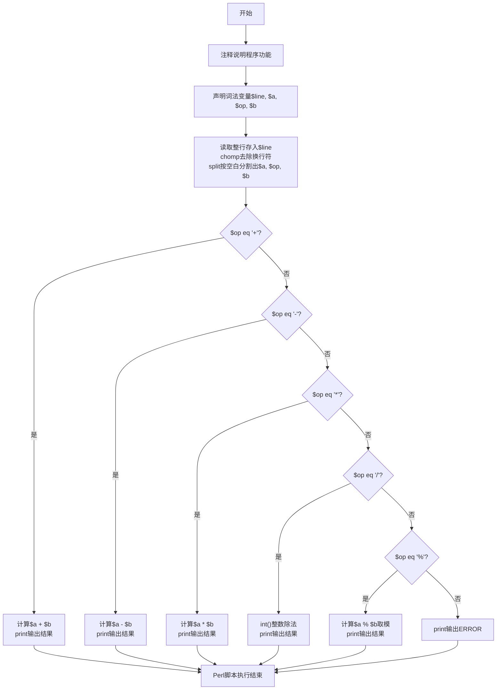
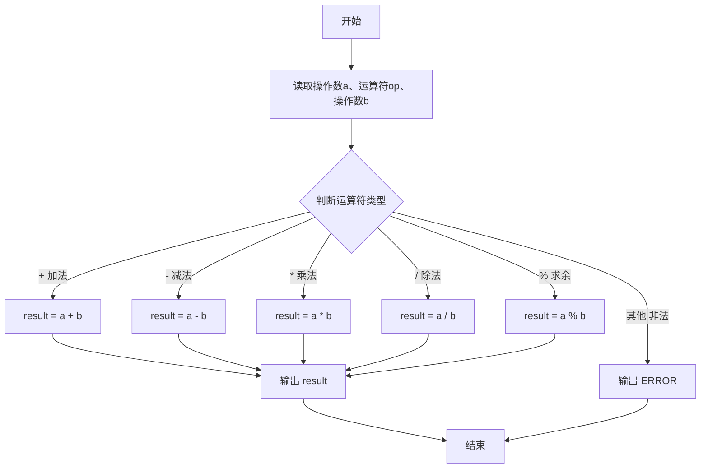

# 7-12 两个数的简单计算器（Perl语言实现）

## 前言

本题（7-12 两个数的简单计算器）的主要考点是：准确理解题意、规范处理输入输出格式，并正确处理边界与精度。下面先给出题目描述与格式要求，再通过清晰的思路与可直接运行的perl代码进行讲解。

## 题目描述

本题要求编写一个简单计算器程序，可根据输入的运算符，对2个整数进行加、减、乘、除或求余运算。题目保证输入和输出均不超过整型范围。

## 输入格式

输入在一行中依次输入操作数1、运算符、操作数2，其间以1个空格分隔。操作数的数据类型为整型，且保证除法和求余的分母非零。

## 输出格式

当运算符为+、-、*、/、%时，在一行输出相应的运算结果。若输入是非法符号（即除了加、减、乘、除和求余五种运算符以外的其他符号）则输出ERROR。

## 输入样例1

```in
-7 / 2
```

## 输入样例2

```in
3 & 6
```

## 输出样例1

```out
-3
```

## 输出样例2

```out
ERROR
```

## 解题思路

### 核心问题分析
本题是一个典型的**多分支选择结构**问题。核心在于根据输入的运算符类型，对两个整数执行对应的算术运算。需要处理的情况包括：
- 5种合法运算符：+、-、*、/、%
- 1种非法情况：运算符不是上述5种之一，输出ERROR

### 算法原理说明
使用**多分支条件判断结构**（if-elsif链）实现运算符的分类处理：
1. 依次读取操作数a、运算符op、操作数b
2. 根据运算符op的不同，选择执行对应的算术运算
3. 对于合法运算符，计算并输出结果
4. 对于非法运算符，输出ERROR提示

### 具体计算步骤
1. 输入两个整数a、b和一个运算符op
2. 判断op是否为'+'：是则计算 a + b 并输出
3. 否则判断op是否为'-'：是则计算 a - b 并输出
4. 否则判断op是否为'*'：是则计算 a * b 并输出
5. 否则判断op是否为'/'：是则计算 a / b 并输出（整数除法）
6. 否则判断op是否为'%'：是则计算 a % b 并输出（取余）
7. 以上都不是则输出 ERROR

### 1. 验证样例：

- 样例1：-7 / 2 → 整数除法结果为 -3 ✓
- 样例2：3 & 6 → &不是合法运算符，输出ERROR ✓

## 完整代码

```perl
#!/usr/bin/perl
use strict;
use warnings;

# 7-12 两个数的简单计算器
my ($a, $op, $b) = split /\s+/, <STDIN>;

if (!defined $a || !defined $op || !defined $b) {
    print "ERROR\n";
    exit;
}

if ($op eq '+') {
    print $a + $b, "\n";
} elsif ($op eq '-') {
    print $a - $b, "\n";
} elsif ($op eq '*') {
    print $a * $b, "\n";
} elsif ($op eq '/') {
    if ($b == 0) {
        print "ERROR\n";
    } else {
        print int($a / $b), "\n";
    }
} elsif ($op eq '%') {
    if ($b == 0) {
        print "ERROR\n";
    } else {
        my $q = int($a / $b);
        print $a - $q * $b, "\n";
    }
} else {
    print "ERROR\n";
}
```

## 代码流程说明

1. **注释说明**
   - `# 7-12 两个数的简单计算器`：单行注释，说明程序功能

2. **变量声明与数据输入**
   - `my $line = <STDIN>;`：声明词法变量$line，从标准输入读取整行
   - `chomp $line;`：去除行尾换行符
   - `my ($a, $op, $b) = split /\s+/, $line;`：使用split按空白字符分割输入
     - `/\s+/`：匹配一个或多个空白字符作为分隔符
     - $a：存储第一个操作数
     - $op：存储运算符
     - $b：存储第二个操作数

3. **多分支运算处理**
   - `if ($op eq '+') {`：判断是否为加法运算符（字符串比较用eq）
     - `print($a + $b . "\n")` 计算两数之和并输出
   - `} elsif ($op eq '-') {`：判断是否为减法运算符
     - `print($a - $b . "\n")` 计算两数之差并输出
   - `} elsif ($op eq '*') {`：判断是否为乘法运算符
     - `print($a * $b . "\n")` 计算两数之积并输出
   - `} elsif ($op eq '/') {`：判断是否为除法运算符
     - `print(int($a / $b) . "\n")` 使用int()进行整数除法（向零取整）并输出
   - `} elsif ($op eq '%') {`：判断是否为求余运算符
     - `print($a % $b . "\n")` 计算取余结果并输出
   - `} else {`：非法运算符处理
     - `print("ERROR\n")` 输出错误提示
   - `}`：if-elsif条件结构结束

4. **程序结束**
   - Perl脚本执行完毕，程序正常退出

## 代码流程图



## 解题流程图



## 代码解析

```perl
#!/usr/bin/perl
use strict;
use warnings;

# 7-12 两个数的简单计算器
my ($a, $op, $b) = split /\s+/, <STDIN>;

if (!defined $a || !defined $op || !defined $b) {
    print "ERROR\n";
    exit;
}

if ($op eq '+') {
    print $a + $b, "\n";
} elsif ($op eq '-') {
    print $a - $b, "\n";
} elsif ($op eq '*') {
    print $a * $b, "\n";
} elsif ($op eq '/') {
    if ($b == 0) {
        print "ERROR\n";
    } else {
        print int($a / $b), "\n";
    }
} elsif ($op eq '%') {
    if ($b == 0) {
        print "ERROR\n";
    } else {
        my $q = int($a / $b);
        print $a - $q * $b, "\n";
    }
} else {
    print "ERROR\n";
}
```

注释说明

## 复杂度分析

设输入规模为 $n$（对数值类题目为参与运算的数据量，对字符串/序列类题目为长度）。

- **时间复杂度**：$O(n)$ 或 $O(n \log n)$，主要来自一次线性遍历与常数次数学运算，无嵌套高复杂度循环。
- **空间复杂度**：$O(n)$，用于存储输入、中间结果与输出字符串；若仅使用若干标量变量则为 $O(1)$。

## 常见易错点

### 1. 输入/输出格式不符
错误：多余空格、遗漏换行、大小写或精度不符。后果：判题系统判为格式错误。正确：严格按题目要求的格式输出，数值用合适精度。

### 2. 边界条件遗漏
错误：未处理 0、最小值、单字符或空输入等边界。后果：特例 WA。正确：先列出所有边界样例，在编码前单独分支处理。

### 3. 整数溢出与类型
错误：使用过小的整数类型或忽略负号。后果：大数计算溢出。正确：按数据范围选择合适类型，必要时用更大整数类型或字符串处理。

## 更多测试

### 测试一：常规边界

**输入：**

```text
（可取题目边界附近的值，如最小值或最大值）
```

**输出：**

```text
（依据题意推导的正确结果）
```

### 测试二：特殊用例

**输入：**

```text
（可取易错点，如 0、单一元素、全同值等）
```

**输出：**

```text
（对应正确结果）
```

## 总结

本题的核心在于理清「两个数的简单计算器」的输入输出关系与边界处理：先按格式读取输入，再依据规则逐步计算或遍历，最后按规范输出。该思路可迁移到同类格式化输入输出与模拟计算的题目。

