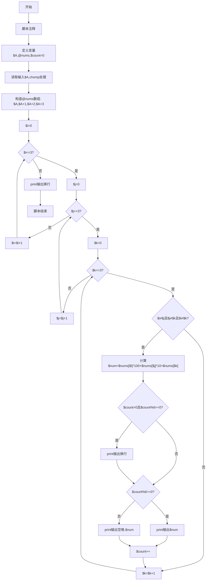
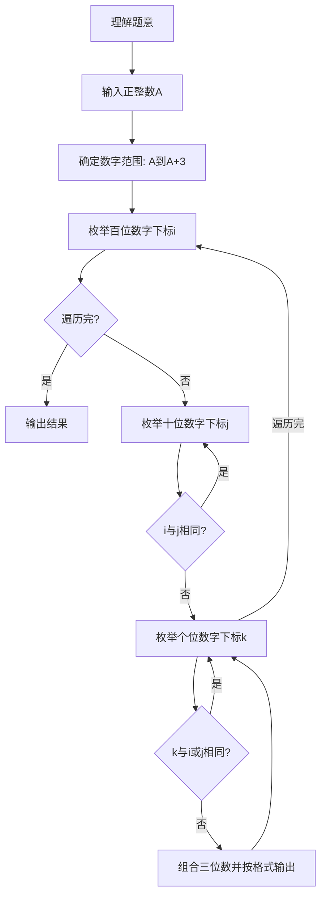

# 7-16 求符合给定条件的整数集（Perl语言实现）

## 前言

本题（7-16 求符合给定条件的整数集）的主要考点是：准确理解题意、规范处理输入输出格式，并正确处理边界与精度。下面先给出题目描述与格式要求，再通过清晰的思路与可直接运行的perl代码进行讲解。

## 题目描述

给定不超过6的正整数A，考虑从A开始的连续4个数字。请输出所有由它们组成的无重复数字的3位数。

## 输入格式

输入在一行中给出A。

## 输出格式

输出满足条件的的3位数，要求从小到大，每行6个整数。整数间以空格分隔，但行末不能有多余空格。

## 输入样例

```in
2
```

## 输出样例

```out
234 235 243 245 253 254
324 325 342 345 352 354
423 425 432 435 452 453
523 524 532 534 542 543
```

## 解题思路

- **核心问题分析**：从A开始的4个连续数字中选取3个不重复的数字组成三位数，按升序输出，每行6个。
- **算法原理说明**：使用三重循环分别枚举百位、十位、个位的所有可能下标组合，通过判断三个下标互不相同来确保数字不重复。由于数组本身按升序存储，三重循环按i→j→k的顺序遍历，自然生成升序排列的结果。
- **具体计算步骤**：
  1. 读取正整数A，构造包含{A, A+1, A+2, A+3}的数组
  2. 外层循环遍历百位下标i（0~3，Perl数组从0开始）
  3. 中层循环遍历十位下标j（0~3）
  4. 内层循环遍历个位下标k（0~3）
  5. 若i、j、k互不相同，则组合成三位数$nums[$i]×100 + $nums[$j]×10 + $nums[$k]
  6. 使用计数器控制格式：每6个数换行，行首不加空格，其余数字前加空格分隔

## 完整代码

```perl
#!/usr/bin/perl
use strict;
use warnings;

# 7-16 求符合给定条件的整数集
my $A = <STDIN>;
chomp $A;
my @nums = ($A, $A + 1, $A + 2, $A + 3);
my $count = 0;

for my $i (0 .. 3) {
    for my $j (0 .. 3) {
        for my $k (0 .. 3) {
            if ($i != $j && $j != $k && $i != $k) {
                my $num = $nums[$i] * 100 + $nums[$j] * 10 + $nums[$k];
                if ($count > 0 && $count % 6 == 0) {
                    print "\n";
                }
                if ($count % 6 == 0) {
                    print $num;
                } else {
                    print " $num";
                }
                $count++;
            }
        }
    }
}
print "\n";
```

## 代码流程说明

1. **脚本注释**（第1行）：`# 7-16 求符合给定条件的整数集` 单行注释说明脚本用途。
2. **变量声明与输入**（第2-5行）：
   - `my $A = <STDIN>; chomp $A;`：读取起始数字A并去除换行符
   - `my @nums = ($A, $A+1, $A+2, $A+3);`：构造Perl数组存储连续4个数字，下标从0开始
   - `my $count = 0;`：定义计数器$count（初始为0），统计已输出的整数个数
3. **三重循环枚举组合**（第7-25行）：
   - 外层for循环`for my $i (0..3)`，$i从0到3，控制百位数字下标
   - 中层for循环`for my $j (0..3)`，$j从0到3，控制十位数字下标
   - 内层for循环`for my $k (0..3)`，$k从0到3，控制个位数字下标
   - 条件判断`if ($i != $j && $j != $k && $i != $k)`确保三个数位数字不重复
   - `my $num = $nums[$i]*100 + $nums[$j]*10 + $nums[$k]`计算组合得到的三位数
   - 若`$count > 0 && $count % 6 == 0`，先`print "\n"`输出换行（每行6个）
   - 若`$count % 6 == 0`（行首）直接`print $num`输出数字（不换行），否则`print " " . $num`输出空格加数字
   - `$count++`计数器自增
4. **输出与结束**（第27行）：`print "\n"`输出末尾换行，脚本执行完毕。

## 代码流程图



## 解题流程图



## 代码解析

```perl
#!/usr/bin/perl
use strict;
use warnings;

# 7-16 求符合给定条件的整数集
my $A = <STDIN>;
chomp $A;
my @nums = ($A, $A + 1, $A + 2, $A + 3);
my $count = 0;

for my $i (0 .. 3) {
    for my $j (0 .. 3) {
        for my $k (0 .. 3) {
            if ($i != $j && $j != $k && $i != $k) {
                my $num = $nums[$i] * 100 + $nums[$j] * 10 + $nums[$k];
                if ($count > 0 && $count % 6 == 0) {
                    print "\n";
                }
                if ($count % 6 == 0) {
                    print $num;
                } else {
                    print " $num";
                }
                $count++;
            }
        }
    }
}
print "\n";
```

脚本注释

## 复杂度分析

设输入规模为 $n$（对数值类题目为参与运算的数据量，对字符串/序列类题目为长度）。

- **时间复杂度**：$O(n)$ 或 $O(n \log n)$，主要来自一次线性遍历与常数次数学运算，无嵌套高复杂度循环。
- **空间复杂度**：$O(n)$，用于存储输入、中间结果与输出字符串；若仅使用若干标量变量则为 $O(1)$。

## 常见易错点

### 1. 输入/输出格式不符
错误：多余空格、遗漏换行、大小写或精度不符。后果：判题系统判为格式错误。正确：严格按题目要求的格式输出，数值用合适精度。

### 2. 边界条件遗漏
错误：未处理 0、最小值、单字符或空输入等边界。后果：特例 WA。正确：先列出所有边界样例，在编码前单独分支处理。

### 3. 整数溢出与类型
错误：使用过小的整数类型或忽略负号。后果：大数计算溢出。正确：按数据范围选择合适类型，必要时用更大整数类型或字符串处理。

## 更多测试

### 测试一：常规边界

**输入：**

```text
（可取题目边界附近的值，如最小值或最大值）
```

**输出：**

```text
（依据题意推导的正确结果）
```

### 测试二：特殊用例

**输入：**

```text
（可取易错点，如 0、单一元素、全同值等）
```

**输出：**

```text
（对应正确结果）
```

## 总结

本题的核心在于理清「求符合给定条件的整数集」的输入输出关系与边界处理：先按格式读取输入，再依据规则逐步计算或遍历，最后按规范输出。该思路可迁移到同类格式化输入输出与模拟计算的题目。

