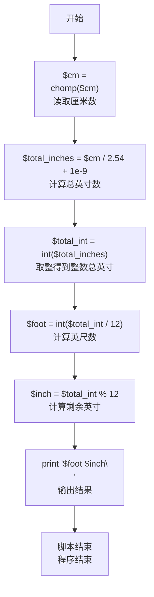
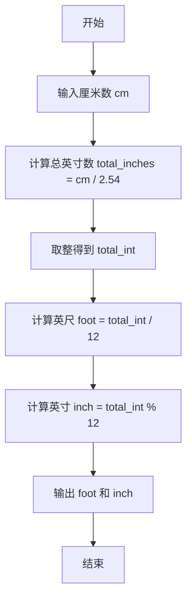

# 7-1 厘米换算英尺英寸（Perl语言实现）

## 前言

本题（7-1 厘米换算英尺英寸）的主要考点是：准确理解题意、规范处理输入输出格式，并正确处理边界与精度。下面先给出题目描述与格式要求，再通过清晰的思路与可直接运行的perl代码进行讲解。

## 题目描述

如果已知英制长度的英尺*f**oo**t*和英寸*in**c**h*的值，那么对应的米是(*f**oo**t*+*in**c**h*/12)×0.3048。现在，如果用户输入的是厘米数，那么对应英制长度的英尺和英寸是多少呢？别忘了1英尺等于12英寸。

## 输入格式

输入在一行中给出1个正整数，单位是厘米。

## 输出格式

在一行中输出这个厘米数对应英制长度的英尺和英寸的整数值，中间用空格分开。英寸的值应小于12。

## 输入样例

```in
170
```

## 输出样例

```out
5 6
```

## 解题思路

本题要求把输入的厘米数换算成英制的英尺和英寸。根据 1 英尺 = 12 英寸、1 英寸 = 2.54 厘米的关系，先把厘米数除以 2.54 得到总英寸数（代码中加上一个极小量 1e-9 以避免浮点运算的精度误差），再用 int() 取整，最后用整除 12 得到英尺数、对 12 取余得到剩余的英寸数，按"英尺 英寸"的格式输出即可。

### 计算步骤

1. 读取输入的厘米数 cm
2. 计算总英寸数 total_inches = cm / 2.54 + 1e-9
3. 用 int() 将总英寸数向零取整存入 total_int
4. 计算英尺数 foot = int(total_int / 12)
5. 计算剩余英寸数 inch = total_int % 12
6. 按"foot inch"格式输出结果

## 完整代码

```perl
#!/usr/bin/perl # 指定使用perl解释器执行此脚本
use strict; # 启用严格模式，要求变量声明
use warnings; # 启用警告模式，输出潜在问题警告

my $cm = <STDIN>; # 从标准输入读取一行，存储厘米数
chomp $cm; # 去除行末换行符
my $total_inches = $cm / 2.54 + 1e-9; # 厘米除以2.54得到总英寸，加1e-9避免浮点精度问题
my $total_int = int($total_inches); # 将总英寸浮点数转为整数（向零取整）
my $foot = int($total_int / 12); # 计算英尺数：总英寸整数除以12后取整
my $inch = $total_int % 12; # 计算剩余英寸数：总英寸整数对12取余
print "$foot $inch\n"; # 输出英尺和英寸，中间用空格分隔，末尾换行
```

## 代码流程说明

### 1. 变量声明与读取输入
- 使用 `my` 声明标量变量 `$cm`（厘米数）
- 通过 `<STDIN>` 从标准输入读取一行，使用 `chomp()` 去除换行符

### 2. 计算总英寸数
- `$total_inches = $cm / 2.54 + 1e-9`：厘米除以2.54得到总英寸数，加1e-9避免浮点精度误差
- `$total_int = int($total_inches)`：将总英寸数向零取整存入整数变量

### 3. 计算英尺
- `$foot = int($total_int / 12)`：总英寸整数除以12后取整得到整英尺数

### 4. 计算英寸
- `$inch = $total_int % 12`：总英寸整数对12取余得到剩余英寸数（必然小于12）

### 5. 输出结果
- 使用 `print` 输出 `$foot $inch`，中间以空格分隔并添加换行符 `\n`

## 代码流程图



## 解题流程图



## 代码解析

```perl
#!/usr/bin/perl # 指定使用perl解释器执行此脚本
use strict; # 启用严格模式，要求变量声明
use warnings; # 启用警告模式，输出潜在问题警告

my $cm = <STDIN>; # 从标准输入读取一行，存储厘米数
chomp $cm; # 去除行末换行符
my $total_inches = $cm / 2.54 + 1e-9; # 厘米除以2.54得到总英寸，加1e-9避免浮点精度问题
my $total_int = int($total_inches); # 将总英寸浮点数转为整数（向零取整）
my $foot = int($total_int / 12); # 计算英尺数：总英寸整数除以12后取整
my $inch = $total_int % 12; # 计算剩余英寸数：总英寸整数对12取余
print "$foot $inch\n"; # 输出英尺和英寸，中间用空格分隔，末尾换行
```

变量声明与读取输入

## 复杂度分析

设输入规模为 $n$（对数值类题目为参与运算的数据量，对字符串/序列类题目为长度）。

- **时间复杂度**：$O(n)$ 或 $O(n \log n)$，主要来自一次线性遍历与常数次数学运算，无嵌套高复杂度循环。
- **空间复杂度**：$O(n)$，用于存储输入、中间结果与输出字符串；若仅使用若干标量变量则为 $O(1)$。

## 常见易错点

### 1. 输入/输出格式不符
错误：多余空格、遗漏换行、大小写或精度不符。后果：判题系统判为格式错误。正确：严格按题目要求的格式输出，数值用合适精度。

### 2. 边界条件遗漏
错误：未处理 0、最小值、单字符或空输入等边界。后果：特例 WA。正确：先列出所有边界样例，在编码前单独分支处理。

### 3. 整数溢出与类型
错误：使用过小的整数类型或忽略负号。后果：大数计算溢出。正确：按数据范围选择合适类型，必要时用更大整数类型或字符串处理。

## 更多测试

### 测试一：常规边界

**输入：**

```text
254
```

**输出：**

```text
8 4
```

### 测试二：特殊用例

**输入：**

```text
30
```

**输出：**

```text
0 11
```

## 总结

本题的核心在于理清「厘米换算英尺英寸」的输入输出关系与边界处理：先按格式读取输入，再依据规则逐步计算或遍历，最后按规范输出。该思路可迁移到同类格式化输入输出与模拟计算的题目。
