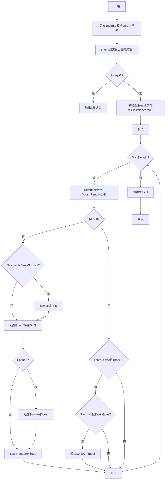
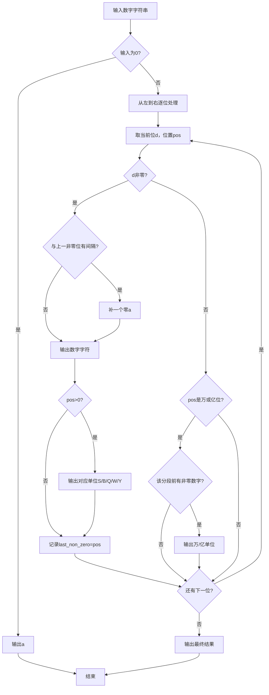

# 7-23 币值转换（Perl语言实现）

## 前言

本题（7-23 币值转换）的主要考点是：准确理解题意、规范处理输入输出格式，并正确处理边界与精度。下面先给出题目描述与格式要求，再通过清晰的思路与可直接运行的perl代码进行讲解。

## 题目描述

输入一个整数（位数不超过9位）代表一个人民币值（单位为元），请转换成财务要求的大写中文格式。如23108元，转换后变成“贰万叁仟壹百零捌”元。为了简化输出，用小写英文字母a-j顺序代表大写数字0-9，用S、B、Q、W、Y分别代表拾、百、仟、万、亿。于是23108元应被转换输出为“cWdQbBai”元。

## 输入格式

输入在一行中给出一个不超过9位的非负整数。

## 输出格式

在一行中输出转换后的结果。注意“零”的用法必须符合中文习惯。

## 输入样例1

```in
813227345
```

## 输入样例2

```in
6900
```

## 输出样例1

```out
iYbQdBcScWhQdBeSf
```

## 输出样例2

```out
gQjB
```

## 解题思路

### 1. 核心问题分析

将数字金额转换为中文财务大写格式，难点在于"零"的处理规则：
1. 连续的多个零只需输出一个"零"(a)
2. 每段末尾（万位、亿位等大单位前）的零可以省略
3. 万位(W)和亿位(Y)作为分段单位，即使该段全零有时也需保留单位

### 2. 算法原理

逐位处理输入字符串。对每一位数字：
- 非零数字：若与上一个非零数字之间隔有零位，先补一个"零"(a)，再输出数字和对应单位
- 零数字：不直接输出，但在遇到万/亿位等大单位时，检查该段是否有非零数字以决定是否输出单位

维护last_non_zero记录上一个非零数字的位置(pos)，用于判断两个非零数字间是否需要补零，以及判断万/亿单位是否有效。

### 3. 具体计算步骤

1. 输入数字字符串s，特判s=="0"时直接输出"a"
2. 从左到右遍历每一位：
   - pos = len-1-i 为当前位的位置权重（个位0、十位1...）
   - 非零数字：若last_non_zero-pos > 1则补"a"，输出数字+单位，更新last_non_zero
   - 零数字：若pos是4或8（万/亿位），且last_non_zero>pos则输出单位
3. 输出结果字符串

## 完整代码

```perl
#!/usr/bin/perl
use strict;
use warnings;

my $num_str = 'abcdefghij';
my @unit_sec = ('', 'S', 'B', 'Q');

sub sec_to_str {
    my ($sec) = @_;
    my @d = (int($sec/1000), int(($sec%1000)/100), int(($sec%100)/10), $sec%10);
    my @u = ('Q','B','S','');
    my $out = '';
    my $started = 0;
    my $pending = 0;
    for my $i (0..3) {
        if ($d[$i] != 0) {
            $out .= 'a' if $pending;
            $pending = 0;
            $out .= substr($num_str, $d[$i], 1);
            $out .= $u[$i] if $u[$i] ne '';
            $started = 1;
        } else {
            $pending = 1 if $started;
        }
    }
    return $out;
}

chomp(my $s = <STDIN>);
$s =~ s/\s+//g if defined $s;

if ($s eq '0' || $s eq '') {
    print "a\n";
    exit;
}

# 去除前导零
$s =~ s/^0+//;
$s = '0' if $s eq '';

my $num = int($s);
my $yi  = int($num / 100000000);
my $wan = int(($num % 100000000) / 10000);
my $ge  = $num % 10000;

my $res = '';

if ($yi != 0) {
    $res .= sec_to_str($yi) . 'Y';
}
if ($wan != 0) {
    $res .= 'a' if ($res ne '' && $wan < 1000);
    $res .= sec_to_str($wan) . 'W';
}
if ($ge != 0) {
    if ($res ne '') {
        my $need = 0;
        if ($wan != 0) {
            $need = 1 if $ge < 1000;
        } elsif ($yi != 0) {
            $need = 1;
        }
        $res .= 'a' if $need;
    }
    $res .= sec_to_str($ge);
}

print "$res\n";
```

## 代码流程说明

1. **字符映射初始化**：$numStr字符串映射0-9到a-j（用substr($numStr, $d, 1)取字符），@unitArr数组映射位置pos到单位（个位为0无单位）
2. **输入与特判**：使用chomp(my $s = <STDIN>)读取整行，$s =~ s/\s+//g去除空白，length($s)获取长度；若$s eq "0"直接print("a\n")并结束
3. **遍历处理每一位**：for my $i (0..$length-1)
   - $d = substr($s, $i, 1) + 0获取当前位数字，$pos = $length - 1 - $i为位置权重（个位0、十位1...）
   - $d != 0时：若$lastNonZero != -1且$lastNonZero - $pos > 1则用.追加"a"（补零），再追加substr($numStr, $d, 1)数字字符，$pos>0时追加$unitArr[$pos]单位，更新$lastNonZero = $pos
   - $d == 0时：若$pos % 4 == 0且$pos > 0（万/亿位），且$lastNonZero != -1且$lastNonZero > $pos则追加$unitArr[$pos]单位
4. **结果输出**：使用print($result . "\n")输出最终字符串

## 代码流程图



## 解题流程图



## 代码解析

```perl
#!/usr/bin/perl
use strict;
use warnings;

my $num_str = 'abcdefghij';
my @unit_sec = ('', 'S', 'B', 'Q');

sub sec_to_str {
    my ($sec) = @_;
    my @d = (int($sec/1000), int(($sec%1000)/100), int(($sec%100)/10), $sec%10);
    my @u = ('Q','B','S','');
    my $out = '';
    my $started = 0;
    my $pending = 0;
    for my $i (0..3) {
        if ($d[$i] != 0) {
            $out .= 'a' if $pending;
            $pending = 0;
            $out .= substr($num_str, $d[$i], 1);
            $out .= $u[$i] if $u[$i] ne '';
            $started = 1;
        } else {
            $pending = 1 if $started;
        }
    }
    return $out;
}

chomp(my $s = <STDIN>);
$s =~ s/\s+//g if defined $s;

if ($s eq '0' || $s eq '') {
    print "a\n";
    exit;
}

# 去除前导零
$s =~ s/^0+//;
$s = '0' if $s eq '';

my $num = int($s);
my $yi  = int($num / 100000000);
my $wan = int(($num % 100000000) / 10000);
my $ge  = $num % 10000;

my $res = '';

if ($yi != 0) {
    $res .= sec_to_str($yi) . 'Y';
}
if ($wan != 0) {
    $res .= 'a' if ($res ne '' && $wan < 1000);
    $res .= sec_to_str($wan) . 'W';
}
if ($ge != 0) {
    if ($res ne '') {
        my $need = 0;
        if ($wan != 0) {
            $need = 1 if $ge < 1000;
        } elsif ($yi != 0) {
            $need = 1;
        }
        $res .= 'a' if $need;
    }
    $res .= sec_to_str($ge);
}

print "$res\n";
```

字符映射初始化

## 复杂度分析

设输入规模为 $n$（对数值类题目为参与运算的数据量，对字符串/序列类题目为长度）。

- **时间复杂度**：$O(n)$ 或 $O(n \log n)$，主要来自一次线性遍历与常数次数学运算，无嵌套高复杂度循环。
- **空间复杂度**：$O(n)$，用于存储输入、中间结果与输出字符串；若仅使用若干标量变量则为 $O(1)$。

## 常见易错点

### 1. 输入/输出格式不符
错误：多余空格、遗漏换行、大小写或精度不符。后果：判题系统判为格式错误。正确：严格按题目要求的格式输出，数值用合适精度。

### 2. 边界条件遗漏
错误：未处理 0、最小值、单字符或空输入等边界。后果：特例 WA。正确：先列出所有边界样例，在编码前单独分支处理。

### 3. 整数溢出与类型
错误：使用过小的整数类型或忽略负号。后果：大数计算溢出。正确：按数据范围选择合适类型，必要时用更大整数类型或字符串处理。

## 更多测试

### 测试一：常规边界

**输入：**

```text
0
```

**输出：**

```text
a
```

### 测试二：特殊用例

**输入：**

```text
10001
```

**输出：**

```text
bWab
```

## 总结

本题的核心在于理清「币值转换」的输入输出关系与边界处理：先按格式读取输入，再依据规则逐步计算或遍历，最后按规范输出。该思路可迁移到同类格式化输入输出与模拟计算的题目。
