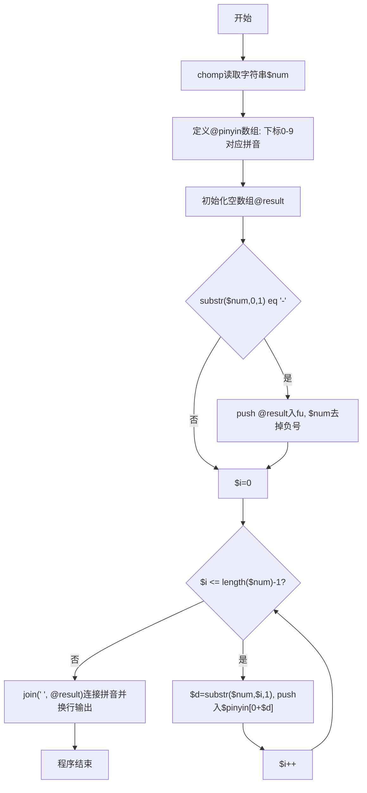
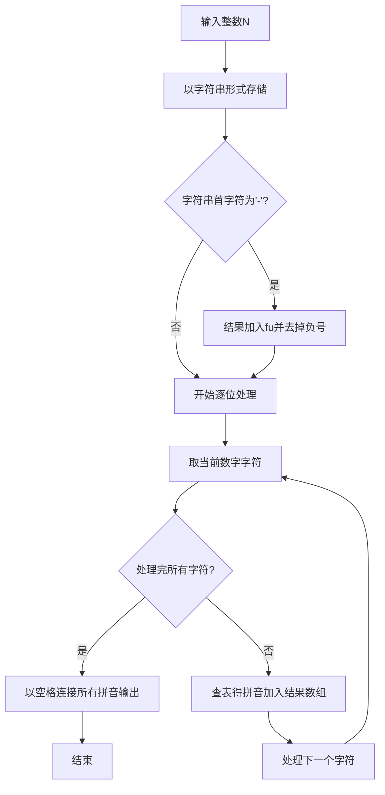

# 7-25 念数字（Perl语言实现）

## 前言

本题（7-25 念数字）的主要考点是：准确理解题意、规范处理输入输出格式，并正确处理边界与精度。下面先给出题目描述与格式要求，再通过清晰的思路与可直接运行的perl代码进行讲解。

## 题目描述

输入一个整数，输出每个数字对应的拼音。当整数为负数时，先输出fu字。十个数字对应的拼音如下：
```in
0: ling
1: yi
2: er
3: san
4: si
5: wu
6: liu
7: qi
8: ba
9: jiu
```

## 输入格式

输入在一行中给出一个整数，如：1234。

提示：整数包括负数、零和正数。

## 输出格式

在一行中输出这个整数对应的拼音，每个数字的拼音之间用空格分开，行末没有最后的空格。如
yi er san si。

## 输入样例

```in
-600
```

## 输出样例

```out
fu liu ling ling
```

## 解题思路

### 1. 核心问题分析

将输入整数的每一位数字转换为对应的拼音输出，负数先输出"fu"。关键是符号处理、逐位转换和空格分隔（行末无空格）。

### 2. 算法原理

将输入作为字符串逐位处理。定义Perl数组@pinyin存储0-9对应的拼音（Perl数组下标从0开始，数字d对应$pinyin[$d]）。若首位字符为负号'-'，先向结果数组@result推入"fu"并去掉负号；随后遍历每一位数字字符，将其转换为数字后作为下标，从@pinyin取得对应拼音推入@result。最后使用join(" ", @result)以单个空格连接所有拼音并换行输出，天然满足"拼音之间用空格分开、行末无空格"的要求。

### 3. 具体计算步骤

1. 以字符串形式读取输入整数并去除换行符
2. 初始化@pinyin数组映射0-9到对应拼音（Perl下标0-9）
3. 初始化空结果数组@result
4. 若首字符为'-'，向@result推入"fu"，并从字符串去掉负号
5. 遍历每个数字字符（for my $i (0..length($num)-1)）：
   - 取出字符$d，用0 + $d转为数字，推入$pinyin[$d]
6. 用join(" ", @result)连接所有拼音并换行输出

## 完整代码

```perl
#!/usr/bin/perl
use strict;
use warnings;

chomp(my $num = <STDIN>);
my @pinyin = ("ling", "yi", "er", "san", "si", "wu", "liu", "qi", "ba", "jiu");

my @result;
if (substr($num, 0, 1) eq '-') {
    push @result, "fu";
    $num = substr($num, 1);
}

for my $i (0 .. length($num) - 1) {
    my $d = substr($num, $i, 1);
    push @result, $pinyin[0 + $d];
}

print join(" ", @result), "\n";
```

## 代码流程说明

1. **输入读取**：使用chomp(my $num = <STDIN>)读取整行字符串并去除换行符
2. **拼音映射表**：定义Perl数组@pinyin，下标0-9对应"ling"到"jiu"（因为Perl数组从0开始）
3. **结果数组初始化**：定义空数组@result，用于收集待输出的所有拼音
4. **负号判断**：若substr($num, 0, 1) eq '-'，用push @result, "fu"将"fu"推入结果数组，并用substr($num, 1)去掉负号
5. **逐位转换循环**：使用for my $i (0 .. length($num) - 1)从第0位遍历到字符串末尾
   - 通过substr($num, $i, 1)提取单个数字字符$d
   - 用0 + $d将其转为数字下标，将$pinyin[$d]推入@result
6. **结果输出**：使用join(" ", @result)以单个空格连接所有拼音并换行输出

## 代码流程图



## 解题流程图



## 代码解析

```perl
#!/usr/bin/perl
use strict;
use warnings;

chomp(my $num = <STDIN>);
my @pinyin = ("ling", "yi", "er", "san", "si", "wu", "liu", "qi", "ba", "jiu");

my @result;
if (substr($num, 0, 1) eq '-') {
    push @result, "fu";
    $num = substr($num, 1);
}

for my $i (0 .. length($num) - 1) {
    my $d = substr($num, $i, 1);
    push @result, $pinyin[0 + $d];
}

print join(" ", @result), "\n";
```

输入读取

## 复杂度分析

设输入规模为 $n$（对数值类题目为参与运算的数据量，对字符串/序列类题目为长度）。

- **时间复杂度**：$O(n)$ 或 $O(n \log n)$，主要来自一次线性遍历与常数次数学运算，无嵌套高复杂度循环。
- **空间复杂度**：$O(n)$，用于存储输入、中间结果与输出字符串；若仅使用若干标量变量则为 $O(1)$。

## 常见易错点

### 1. 输入/输出格式不符
错误：多余空格、遗漏换行、大小写或精度不符。后果：判题系统判为格式错误。正确：严格按题目要求的格式输出，数值用合适精度。

### 2. 边界条件遗漏
错误：未处理 0、最小值、单字符或空输入等边界。后果：特例 WA。正确：先列出所有边界样例，在编码前单独分支处理。

### 3. 整数溢出与类型
错误：使用过小的整数类型或忽略负号。后果：大数计算溢出。正确：按数据范围选择合适类型，必要时用更大整数类型或字符串处理。

## 更多测试

### 测试一：常规边界

**输入：**

```text
0
```

**输出：**

```text
ling
```

### 测试二：特殊用例

**输入：**

```text
-105
```

**输出：**

```text
fu yi ling wu
```

## 总结

本题的核心在于理清「念数字」的输入输出关系与边界处理：先按格式读取输入，再依据规则逐步计算或遍历，最后按规范输出。该思路可迁移到同类格式化输入输出与模拟计算的题目。
