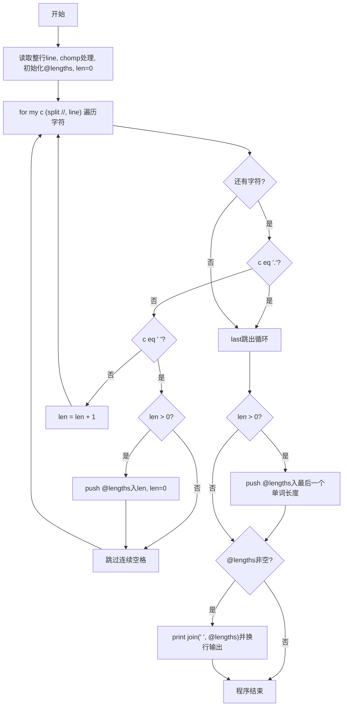
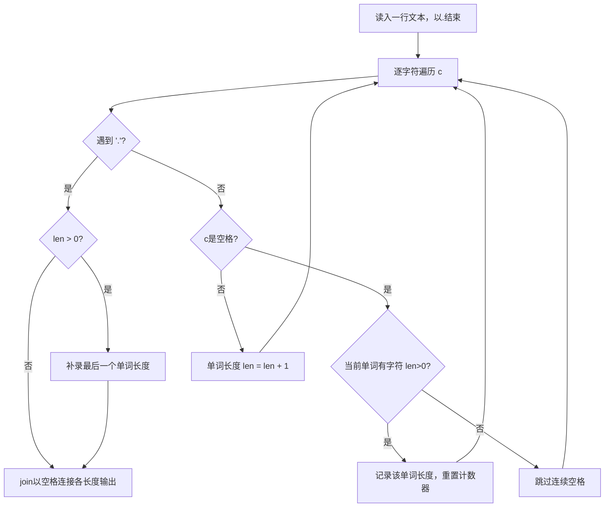

# 7-26 单词长度（Perl语言实现）

## 前言

本题（7-26 单词长度）的主要考点是：准确理解题意、规范处理输入输出格式，并正确处理边界与精度。下面先给出题目描述与格式要求，再通过清晰的思路与可直接运行的perl代码进行讲解。

## 题目描述

你的程序要读入一行文本，其中以空格分隔为若干个单词，以.结束。你要输出每个单词的长度。这里的单词与语言无关，可以包括各种符号，比如it's算一个单词，长度为4。注意，行中可能出现连续的空格；最后的.不计算在内。

## 输入格式

输入在一行中给出一行文本，以.结束

提示：用scanf("%c",...);来读入一个字符，直到读到.为止。

## 输出格式

在一行中输出这行文本对应的单词的长度，每个长度之间以空格隔开，行末没有最后的空格。

## 输入样例

```in
It's great to see you here.
```

## 输出样例

```out
4 5 2 3 3 4
```

## 解题思路

**核心问题分析**：本题需要逐字符读取输入文本，识别空格分隔的单词并统计每个单词的长度，遇到'.'时结束处理。难点在于处理连续空格（不能把连续的多个空格误认为多个单词）和行末无多余空格的格式要求。

**算法原理说明**：采用逐字符遍历法，把整行文本按字符拆分后逐个扫描。用计数器`$len`记录当前单词的长度；遇到空格表示一个单词结束，若`$len > 0`则把该长度存入@lengths数组并清零，连续空格因`$len`已为0而自动跳过；遇到'.'立即停止，最后的句号不参与统计。扫描结束后若`$len > 0`还要补录最后一个单词的长度（它后面没有空格分隔）。最后用join(" ", @lengths)以单个空格连接所有长度输出，天然满足"行末没有最后的空格"的要求。

### 1. 具体计算步骤

1. 使用<STDIN>读取整行文本，chomp去除换行符
2. 初始化长度数组@lengths、当前单词长度计数器$len=0
3. 用split //把文本拆成字符数组并逐个遍历：
   - 遇到'.'：用last终止循环，最后的句号不计入长度
   - 遇到空格：若$len>0则把该单词长度push进@lengths并将$len清零；连续空格因$len为0被跳过
   - 其它字符：$len++累计当前单词长度
4. 循环结束后若$len>0，补录最后一个单词的长度
5. 若@lengths非空，用join(" ", @lengths)以空格连接各长度并换行输出

## 完整代码

```perl
#!/usr/bin/perl
use strict;
use warnings;

chomp(my $line = <STDIN>);

my @lengths;
my $len = 0;

for my $c (split //, $line) {
    last if $c eq '.';
    if ($c eq ' ') {
        if ($len > 0) {
            push @lengths, $len;
            $len = 0;
        }
    } else {
        $len++;
    }
}

push @lengths, $len if $len > 0;

print join(" ", @lengths), "\n" if @lengths;
```

## 代码流程说明

1. **变量初始化**：使用<STDIN>读取整行文本$line，chomp去除换行符，初始化空数组@lengths存放各单词长度，`$len=0`作为当前单词长度计数器
2. **主循环读取字符**：使用for my $c (split //, $line)将文本按字符拆分后逐个遍历，当读到'.'时用last终止循环（最后的句号不计入长度）
3. **空格处理分支**：遇到空格时，若`$len>0`说明当前单词已结束，把该长度push进@lengths并将`$len`清零；连续空格因`$len`已为0而被自动跳过
4. **非空格字符处理**：遇到非空格非'.'字符时，`$len++`累加当前单词长度
5. **最后一个单词处理**：循环结束后，若`$len>0`用push @lengths, $len补录以'.'结尾前最后一个单词的长度
6. **结果输出**：若@lengths非空，用print join(" ", @lengths), "\n"以单个空格连接各长度并换行输出

## 代码流程图



## 解题流程图



## 代码解析

```perl
#!/usr/bin/perl
use strict;
use warnings;

chomp(my $line = <STDIN>);

my @lengths;
my $len = 0;

for my $c (split //, $line) {
    last if $c eq '.';
    if ($c eq ' ') {
        if ($len > 0) {
            push @lengths, $len;
            $len = 0;
        }
    } else {
        $len++;
    }
}

push @lengths, $len if $len > 0;

print join(" ", @lengths), "\n" if @lengths;
```

变量初始化

## 复杂度分析

设输入规模为 $n$（对数值类题目为参与运算的数据量，对字符串/序列类题目为长度）。

- **时间复杂度**：$O(n)$ 或 $O(n \log n)$，主要来自一次线性遍历与常数次数学运算，无嵌套高复杂度循环。
- **空间复杂度**：$O(n)$，用于存储输入、中间结果与输出字符串；若仅使用若干标量变量则为 $O(1)$。

## 常见易错点

### 1. 输入/输出格式不符
错误：多余空格、遗漏换行、大小写或精度不符。后果：判题系统判为格式错误。正确：严格按题目要求的格式输出，数值用合适精度。

### 2. 边界条件遗漏
错误：未处理 0、最小值、单字符或空输入等边界。后果：特例 WA。正确：先列出所有边界样例，在编码前单独分支处理。

### 3. 整数溢出与类型
错误：使用过小的整数类型或忽略负号。后果：大数计算溢出。正确：按数据范围选择合适类型，必要时用更大整数类型或字符串处理。

## 更多测试

### 测试一：常规边界

**输入：**

```text
a.
```

**输出：**

```text
1
```

### 测试二：特殊用例

**输入：**

```text
hi  there.
```

**输出：**

```text
2 5
```

## 总结

本题的核心在于理清「单词长度」的输入输出关系与边界处理：先按格式读取输入，再依据规则逐步计算或遍历，最后按规范输出。该思路可迁移到同类格式化输入输出与模拟计算的题目。
