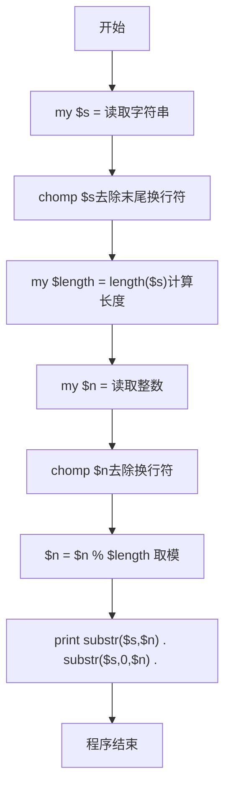
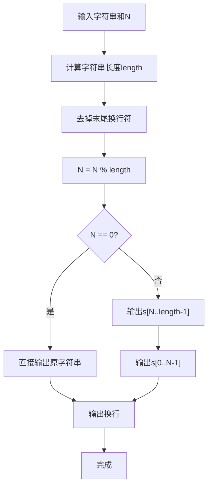

# 7-31 字符串循环左移（Perl语言实现）

## 前言

本题（7-31 字符串循环左移）的主要考点是：准确理解题意、规范处理输入输出格式，并正确处理边界与精度。下面先给出题目描述与格式要求，再通过清晰的思路与可直接运行的perl代码进行讲解。

## 题目描述

输入一个字符串和一个非负整数N，要求将字符串循环左移N次。

## 输入格式

输入在第1行中给出一个不超过100个字符长度的、以回车结束的非空字符串；第2行给出非负整数N。

## 输出格式

在一行中输出循环左移N次后的字符串。

## 输入样例

```in
Hello World!
2
```

## 输出样例

```out
llo World!He
```

## 解题思路

### 核心问题分析
循环左移N次的本质是将字符串前N个字符移动到字符串末尾。例如"Hello World!"左移2次，就是将前2个字符"He"移动到末尾，得到"llo World!He"。

### 算法原理说明
直接模拟移动需要N次操作，每次移动一个字符，时间复杂度为O(N*len)。更高效的方法是利用字符串切片：
- 对N取模（N % len），处理N大于等于字符串长度的情况
- 将字符串分为两部分：[0, N-1] 和 [N, len-1]（Perl下标从0开始）
- 输出顺序为：先输出[N, len-1]部分，再输出[0, N-1]部分
- 时间复杂度O(len)，空间复杂度O(1)（直接输出无需额外存储）

### 具体计算步骤
1. 读取输入字符串s和整数N
2. 去除字符串末尾的换行符，计算实际长度length
3. 对N取模：N = N % length，避免重复移动
4. 输出从位置N到末尾的所有字符（substr($s, $n)）
5. 输出从位置0到N-1的所有字符（substr($s, 0, $n)）

## 完整代码

```perl
#!/usr/bin/perl
use strict;
use warnings;

my $s = <STDIN>;
defined $s or $s = "";
chomp $s;
$s =~ s/\r\z//;
my $n_line = <STDIN>;
$n_line = "0" unless defined $n_line;
chomp $n_line;
my $n = 0;
if ($n_line =~ /(-?\d+)/) { $n = $1; }
my $len = length $s;
if ($len == 0) {
    print "\n";
    exit;
}
$n = $n % $len;
$n = ($n + $len) % $len if $n < 0;
print substr($s, $n), substr($s, 0, $n), "\n";
```

## 代码流程说明

1. **读取字符串**：使用`<STDIN>`读取整行字符串（可包含空格）到变量`s`中，注意读入的字符串末尾带有换行符
2. **去除末尾换行**：使用`chomp $s`去除字符串末尾的换行符
3. **读取左移位数**：使用`<STDIN>`读取整数n，然后`chomp $n`去除换行符
4. **计算字符串长度**：使用`length($s)`计算字符串实际长度
5. **取模优化**：`$n = $n % $length`，当n≥length时只需要移动余数次数
6. **输出结果**：直接使用`print`拼接两个子串：后半部分`substr($s, $n)`和前半部分`substr($s, 0, $n)`，最后加上`\n`换行
7. **程序结束**

## 代码流程图



## 解题流程图



## 代码解析

```perl
#!/usr/bin/perl
use strict;
use warnings;

my $s = <STDIN>;
defined $s or $s = "";
chomp $s;
$s =~ s/\r\z//;
my $n_line = <STDIN>;
$n_line = "0" unless defined $n_line;
chomp $n_line;
my $n = 0;
if ($n_line =~ /(-?\d+)/) { $n = $1; }
my $len = length $s;
if ($len == 0) {
    print "\n";
    exit;
}
$n = $n % $len;
$n = ($n + $len) % $len if $n < 0;
print substr($s, $n), substr($s, 0, $n), "\n";
```

读取字符串

## 复杂度分析

设输入规模为 $n$（对数值类题目为参与运算的数据量，对字符串/序列类题目为长度）。

- **时间复杂度**：$O(n)$ 或 $O(n \log n)$，主要来自一次线性遍历与常数次数学运算，无嵌套高复杂度循环。
- **空间复杂度**：$O(n)$，用于存储输入、中间结果与输出字符串；若仅使用若干标量变量则为 $O(1)$。

## 常见易错点

### 1. 输入/输出格式不符
错误：多余空格、遗漏换行、大小写或精度不符。后果：判题系统判为格式错误。正确：严格按题目要求的格式输出，数值用合适精度。

### 2. 边界条件遗漏
错误：未处理 0、最小值、单字符或空输入等边界。后果：特例 WA。正确：先列出所有边界样例，在编码前单独分支处理。

### 3. 整数溢出与类型
错误：使用过小的整数类型或忽略负号。后果：大数计算溢出。正确：按数据范围选择合适类型，必要时用更大整数类型或字符串处理。

## 更多测试

### 测试一：常规边界

**输入：**

```text
abcde
0
```

**输出：**

```text
abcde
```

### 测试二：特殊用例

**输入：**

```text
abcde
7
```

**输出：**

```text
cdeab
```

## 总结

本题的核心在于理清「字符串循环左移」的输入输出关系与边界处理：先按格式读取输入，再依据规则逐步计算或遍历，最后按规范输出。该思路可迁移到同类格式化输入输出与模拟计算的题目。
