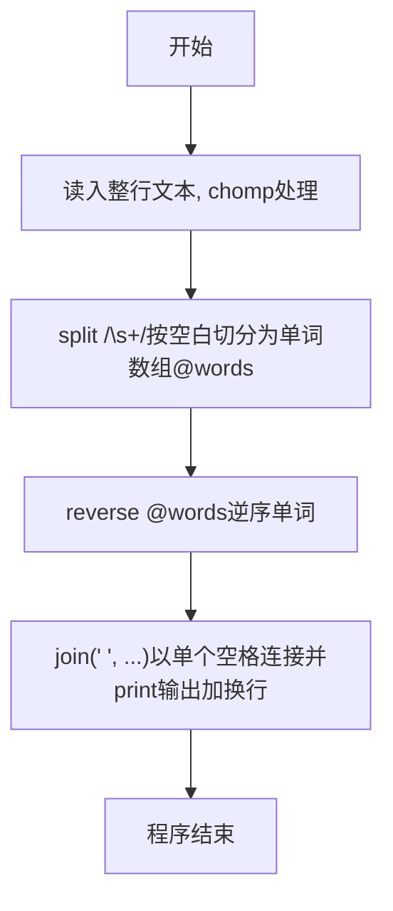
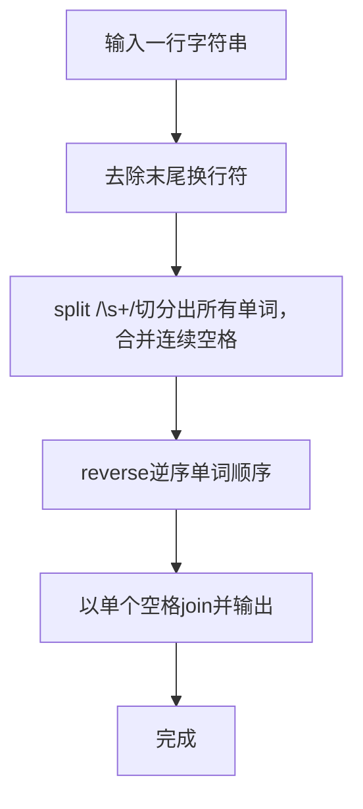

# 7-32 说反话-加强版（Perl语言实现）

## 前言

本题（7-32 说反话-加强版）的主要考点是：准确理解题意、规范处理输入输出格式，并正确处理边界与精度。下面先给出题目描述与格式要求，再通过清晰的思路与可直接运行的perl代码进行讲解。

## 题目描述

给定一句英语，要求你编写程序，将句中所有单词的顺序颠倒输出。

## 输入格式

测试输入包含一个测试用例，在一行内给出总长度不超过500 000的字符串。字符串由若干单词和若干空格组成，其中单词是由英文字母（大小写有区分）组成的字符串，单词之间用若干个空格分开。

## 输出格式

每个测试用例的输出占一行，输出倒序后的句子，并且保证单词间只有1个空格。

## 输入样例

```in
Hello World   Here I Come
```

## 输出样例

```out
Come I Here World Hello
```

## 解题思路

### 核心问题分析
本题要求将句子中的单词顺序颠倒输出，需要处理两个关键点：一是单词之间可能有多个连续空格，二是输出时单词间只能有一个空格。例如输入"Hello World   Here I Come"，连续的空格需要被合并，只保留单词本身参与倒序。

### 算法原理说明
采用"切分、逆序、连接"的策略：
1. **切分**：用`split /\s+/`按一个或多个空白字符把整行文本切分成单词数组@words，正则`\s+`能自动合并单词之间的连续多个空格。
2. **逆序**：用`reverse @words`把单词数组逆序。
3. **连接输出**：以单个空格`join`逆序后的单词后输出，即可得到单词倒序、且单词间只有一个空格的句子。
- 时间复杂度O(n)：切分、逆序、连接各一次线性操作
- 空间复杂度O(w)：w为单词数

### 具体计算步骤
1. 读取整行字符串，去除末尾换行符
2. 用`split /\s+/, $line`按空白切分得到单词数组@words，连续空格自动合并
3. 用`reverse @words`将单词顺序逆序
4. 以单个空格`join`逆序后的单词，print输出加换行

## 完整代码

```perl
#!/usr/bin/perl
use strict;
use warnings;

my $line = <STDIN>;
defined $line or $line = "";
chomp $line;
$line =~ s/\r\z//;
my @words = split ' ', $line;
@words = grep { $_ ne '' } @words;
print join(' ', reverse @words), "\n";
```

## 代码流程说明

1. **读取字符串**：使用`<STDIN>`读取整行字符串到变量$line中
2. **去除末尾换行**：使用`chomp $line`去除字符串末尾的换行符
3. **切分单词**：用`split /\s+/, $line`按一个或多个空白字符切分，得到单词数组@words，连续空格自动合并
4. **逆序并输出**：`reverse @words`逆序单词顺序，`join(' ', ...)`以单个空格连接，print输出加换行

## 代码流程图



## 解题流程图



## 代码解析

```perl
#!/usr/bin/perl
use strict;
use warnings;

my $line = <STDIN>;
defined $line or $line = "";
chomp $line;
$line =~ s/\r\z//;
my @words = split ' ', $line;
@words = grep { $_ ne '' } @words;
print join(' ', reverse @words), "\n";
```

读取字符串

## 复杂度分析

设输入规模为 $n$（对数值类题目为参与运算的数据量，对字符串/序列类题目为长度）。

- **时间复杂度**：$O(n)$ 或 $O(n \log n)$，主要来自一次线性遍历与常数次数学运算，无嵌套高复杂度循环。
- **空间复杂度**：$O(n)$，用于存储输入、中间结果与输出字符串；若仅使用若干标量变量则为 $O(1)$。

## 常见易错点

### 1. 输入/输出格式不符
错误：多余空格、遗漏换行、大小写或精度不符。后果：判题系统判为格式错误。正确：严格按题目要求的格式输出，数值用合适精度。

### 2. 边界条件遗漏
错误：未处理 0、最小值、单字符或空输入等边界。后果：特例 WA。正确：先列出所有边界样例，在编码前单独分支处理。

### 3. 整数溢出与类型
错误：使用过小的整数类型或忽略负号。后果：大数计算溢出。正确：按数据范围选择合适类型，必要时用更大整数类型或字符串处理。

## 更多测试

### 测试一：常规边界

**输入：**

```text
（可取题目边界附近的值，如最小值或最大值）
```

**输出：**

```text
（依据题意推导的正确结果）
```

### 测试二：特殊用例

**输入：**

```text
（可取易错点，如 0、单一元素、全同值等）
```

**输出：**

```text
（对应正确结果）
```

## 总结

本题的核心在于理清「说反话-加强版」的输入输出关系与边界处理：先按格式读取输入，再依据规则逐步计算或遍历，最后按规范输出。该思路可迁移到同类格式化输入输出与模拟计算的题目。

