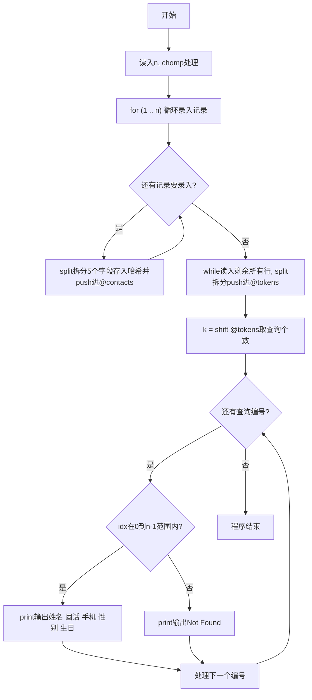
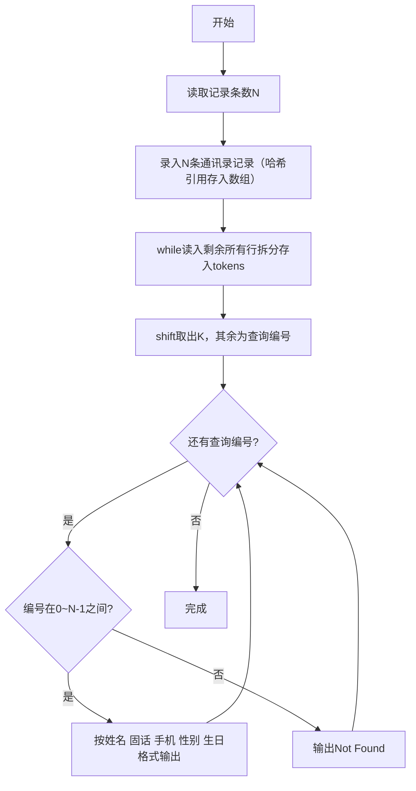

# 7-34 通讯录的录入与显示（Perl语言实现）

## 前言

本题（7-34 通讯录的录入与显示）的主要考点是：准确理解题意、规范处理输入输出格式，并正确处理边界与精度。下面先给出题目描述与格式要求，再通过清晰的思路与可直接运行的perl代码进行讲解。

## 题目描述

通讯录中的一条记录包含下述基本信息：朋友的姓名、出生日期、性别、固定电话号码、移动电话号码。
本题要求编写程序，录入N条记录，并且根据要求显示任意某条记录。

## 输入格式

输入在第一行给出正整数N（≤10）；随后N行，每行按照格式姓名 生日 性别 固话 手机给出一条记录。其中姓名是不超过10个字符、不包含空格的非空字符串；生日按yyyy/mm/dd的格式给出年月日；性别用M表示"男"、F表示"女"；固话和手机均为不超过15位的连续数字，前面有可能出现+。

在通讯录记录输入完成后，最后一行给出正整数K，并且随后给出K个整数，表示要查询的记录编号（从0到N−1顺序编号）。数字间以空格分隔。

## 输出格式

对每一条要查询的记录编号，在一行中按照姓名 固话 手机 性别 生日的格式输出该记录。若要查询的记录不存在，则输出Not Found。

## 输入样例

```in
3
Chris 1984/03/10 F +86181779452 13707010007
LaoLao 1967/11/30 F 057187951100 +8618618623333
QiaoLin 1980/01/01 M 84172333 10086
2 1 7
```

## 输出样例

```out
LaoLao 057187951100 +8618618623333 F 1967/11/30
Not Found
```

## 解题思路

### 核心问题分析
本题需要实现通讯录的录入与查询功能。核心要点有三：一是用合适的数据结构存储多条记录（包含姓名、生日、性别、固话、手机5个字段）；二是按正确顺序输出字段（注意输出顺序与输入顺序不同：输入是姓名-生日-性别-固话-手机，输出是姓名-固话-手机-性别-生日）；三是处理无效查询编号，输出Not Found。

### 算法原理说明
采用数组哈希(AoH, Array of Hashes)+索引查询的方案：
1. **数据结构设计**：使用Perl哈希引用({})作为联系人记录，包含5个字段分别存储一条记录的各项信息，多个哈希引用存入数组`@contacts`。
2. **录入阶段**：读取N后，循环N次用split拆分读取的整行为5个字段，存入匿名哈希并push进数组。
3. **查询阶段**：用while循环读入剩余所有行，K与K个查询编号可能在同一行也可能跨多行分布，统一按空白拆分存入@tokens；shift取出第一个数字作为查询个数K，其余即为查询编号。foreach遍历每个编号，若在[0, N)范围内则按输出顺序输出对应哈希的字段，否则输出"Not Found"。
- 时间复杂度O(N+K)：录入和查询均为线性扫描
- 空间复杂度O(N)：存储N条通讯录记录

### 具体计算步骤
1. 读取正整数N（通讯录记录条数），chomp去除换行
2. 循环N次（for (1 .. $n)）：
   - 读取整行，用split拆分5个字段，构造匿名哈希后push进@contacts
3. while循环读入剩余所有行，每行按空白拆分后push进@tokens
4. shift取出第一个数字作为查询个数K，其余数字为查询编号
5. foreach遍历每个查询编号：
   - 判断编号是否在[0, N)范围内？
     - 是：按"姓名 固话 手机 性别 生日"顺序输出
     - 否：输出"Not Found"

## 完整代码

```perl
#!/usr/bin/perl
use strict;
use warnings;

# 读取记录条数 N
my $n = <STDIN>;
chomp $n;

my @contacts;
for (1 .. $n) {
    # 每行一条记录：姓名 生日 性别 固话 手机
    my ($name, $birthday, $gender, $fixed, $mobile) = split /\s+/, <STDIN>;
    push @contacts, {
        name     => $name,
        birthday => $birthday,
        gender   => $gender,
        fixed    => $fixed,
        mobile   => $mobile,
    };
}

# 读取查询内容：K 与 K 个编号可能在同一行，也可能跨多行，统一按空白拆分
my @tokens;
while (my $line = <STDIN>) {
    chomp $line;
    push @tokens, split /\s+/, $line;
}
my $k = shift @tokens;
$k = 0 unless defined $k;
@tokens = @tokens[0 .. $k-1] if @tokens > $k;

foreach my $idx (@tokens) {
    if ($idx >= 0 && $idx < $n) {
        my $c = $contacts[$idx];
        print "$c->{name} $c->{fixed} $c->{mobile} $c->{gender} $c->{birthday}\n";
    } else {
        print "Not Found\n";
    }
}
```

## 代码流程说明

1. **读取N**：`<STDIN>`读取通讯录记录条数n，`chomp $n`去除换行
2. **定义数组**：`my @contacts`，容纳n条记录（元素为哈希引用）
3. **录入N条记录**：循环n次（`for (1 .. $n)`），每次用`<STDIN>`读取整行，split按空白拆分5个字段，构造匿名哈希并push进@contacts
4. **读取查询内容**：while循环读入剩余所有行（K与K个编号可能在同一行也可能跨多行），每行按空白拆分后push进@tokens
5. **获取查询个数K**：`shift @tokens`取出第一个数字作为$k，其余数字为查询编号
6. **处理查询**：foreach遍历每个查询编号，判断是否在有效范围[0, n)内：有效则按"姓名 固话 手机 性别 生日"顺序输出对应哈希字段，无效则输出"Not Found"
7. **程序自然结束**

## 代码流程图



## 解题流程图



## 代码解析

```perl
#!/usr/bin/perl
use strict;
use warnings;

# 读取记录条数 N
my $n = <STDIN>;
chomp $n;

my @contacts;
for (1 .. $n) {
    # 每行一条记录：姓名 生日 性别 固话 手机
    my ($name, $birthday, $gender, $fixed, $mobile) = split /\s+/, <STDIN>;
    push @contacts, {
        name     => $name,
        birthday => $birthday,
        gender   => $gender,
        fixed    => $fixed,
        mobile   => $mobile,
    };
}

# 读取查询内容：K 与 K 个编号可能在同一行，也可能跨多行，统一按空白拆分
my @tokens;
while (my $line = <STDIN>) {
    chomp $line;
    push @tokens, split /\s+/, $line;
}
my $k = shift @tokens;
$k = 0 unless defined $k;
@tokens = @tokens[0 .. $k-1] if @tokens > $k;

foreach my $idx (@tokens) {
    if ($idx >= 0 && $idx < $n) {
        my $c = $contacts[$idx];
        print "$c->{name} $c->{fixed} $c->{mobile} $c->{gender} $c->{birthday}\n";
    } else {
        print "Not Found\n";
    }
}
```

读取N

## 复杂度分析

设输入规模为 $n$（对数值类题目为参与运算的数据量，对字符串/序列类题目为长度）。

- **时间复杂度**：$O(n)$ 或 $O(n \log n)$，主要来自一次线性遍历与常数次数学运算，无嵌套高复杂度循环。
- **空间复杂度**：$O(n)$，用于存储输入、中间结果与输出字符串；若仅使用若干标量变量则为 $O(1)$。

## 常见易错点

### 1. 输入/输出格式不符
错误：多余空格、遗漏换行、大小写或精度不符。后果：判题系统判为格式错误。正确：严格按题目要求的格式输出，数值用合适精度。

### 2. 边界条件遗漏
错误：未处理 0、最小值、单字符或空输入等边界。后果：特例 WA。正确：先列出所有边界样例，在编码前单独分支处理。

### 3. 整数溢出与类型
错误：使用过小的整数类型或忽略负号。后果：大数计算溢出。正确：按数据范围选择合适类型，必要时用更大整数类型或字符串处理。

## 更多测试

### 测试一：常规边界

**输入：**

```text
1
Alice 2000/01/02 F 123 +456
3 0 1 0
```

**输出：**

```text
Alice 123 +456 F 2000/01/02
Not Found
Alice 123 +456 F 2000/01/02
```

### 测试二：特殊用例

**输入：**

```text
2
Bob 1999/12/31 M 010 +86138
Eve 2001/06/01 F +86 10086
2 0 1
```

**输出：**

```text
Bob 010 +86138 M 1999/12/31
Eve +86 10086 F 2001/06/01
```

## 总结

本题的核心在于理清「通讯录的录入与显示」的输入输出关系与边界处理：先按格式读取输入，再依据规则逐步计算或遍历，最后按规范输出。该思路可迁移到同类格式化输入输出与模拟计算的题目。
