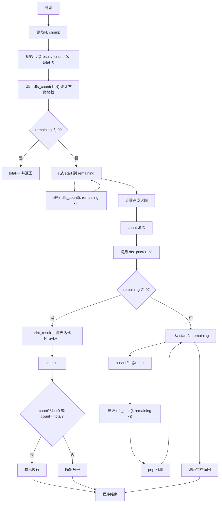
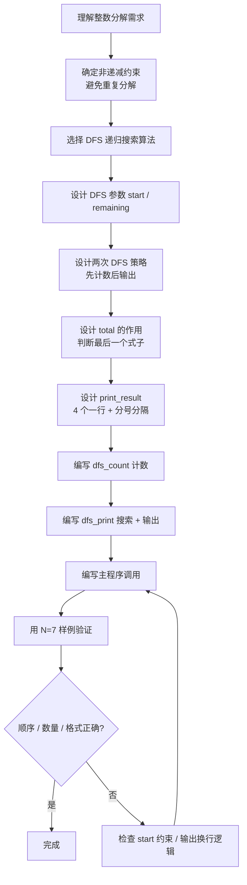

# 7-37 整数分解为若干项之和（Perl语言实现）

## 前言

本题（7-37 整数分解为若干项之和）的主要考点是：准确理解题意、规范处理输入输出格式，并正确处理边界与精度。下面先给出题目描述与格式要求，再通过清晰的思路与可直接运行的perl代码进行讲解。

## 题目描述

将一个正整数 N 分解成几个正整数相加，可以有多种分解方法，例如 7=6+1，7=5+2，7=5+1+1，…。编程求出正整数 N 的所有整数分解式子。

## 输入格式

每个输入包含一个测试用例，即正整数 N (0<N≤30)。

## 输出格式

按递增顺序输出 N 的所有整数分解式子。递增顺序是指：对于两个分解序列 N₁={n₁,n₂,⋯} 和 N₂={m₁,m₂,⋯}，若存在 i 使得 n₁=m₁,⋯,nᵢ=mᵢ，但是 nᵢ₊₁<mᵢ₊₁，则 N₁序列必定在 N₂序列之前输出。每个式子由小到大相加，式子间用分号隔开，且每输出 4 个式子后换行。

## 输入样例

```in
7
```

## 输出样例

```out
7=1+1+1+1+1+1+1;7=1+1+1+1+1+2;7=1+1+1+1+3;7=1+1+1+2+2
7=1+1+1+4;7=1+1+2+3;7=1+1+5;7=1+2+2+2
7=1+2+4;7=1+3+3;7=1+6;7=2+2+3
7=2+5;7=3+4;7=7
```

## 解题思路

### 核心问题分析
本题需要解决的核心问题：
1. **生成所有分解方案**：找出正整数N的所有正整数和分解（整数分拆）
2. **递增顺序**：分解序列必须非递减排列（如1+1+5，而非1+5+1），避免重复
3. **输出格式**：每4个式子一行，用分号分隔，最后一个式子后换行

### 算法原理说明
- **深度优先搜索(DFS)**：递归地构建分解序列。关键参数：
  - `start`：当前可选的最小数（保证序列非递减，避免重复）
  - `remaining`：剩余需要分解的值
- **两次DFS策略**：
  - 第一遍`dfs_count`：只计数，不输出，得到方案总数`$total`
  - 第二遍`dfs_print`：实际输出，利用`$total`判断是否是最后一个式子（决定输出换行还是分号）
- **非递减约束**：循环从`start`开始，下一层递归起点仍为`i`，保证后续数≥当前数
- **回溯**：进入递归前用`push`把当前项加入结果数组`@result`，返回后用`pop`恢复现场

### 具体计算步骤
1. 读入正整数N，用chomp去除换行符
2. 初始化结果数组`@result`、方案计数`$count`、方案总数`$total`
3. 第一遍DFS（`dfs_count(1, $N)`）：从1开始枚举，递归统计分解方案总数`$total`
4. 将`$count`清零
5. 第二遍DFS（`dfs_print(1, $N)`）：同样的搜索顺序，每找到一个完整方案就调用`print_result`输出
6. `print_result`中：把`@result`拼成"N=a+b+..."格式，`$count`自增，满4个或为最后一个式子输出换行，否则输出分号

## 完整代码

```perl
#!/usr/bin/perl
use strict;
use warnings;

# 待分解的正整数 N
my $N = <STDIN>;
chomp($N);

my @result;                     # 存储当前分解方案的各项
my ($count, $total) = (0, 0);   # 已输出方案数、方案总数

# 第一遍 DFS：只统计分解方案总数
sub dfs_count {
    my ($start, $remaining) = @_;
    if ($remaining == 0) {
        $total++;
        return;
    }
    for my $i ($start .. $remaining) {
        dfs_count($i, $remaining - $i);
    }
}

# 输出一个分解方案，满 4 个换行否则分号
sub print_result {
    my $expr = "$N=" . $result[0];
    for my $i (1 .. $#result) {
        $expr .= "+" . $result[$i];
    }
    $count++;
    if ($count % 4 == 0 || $count == $total) {
        print "$expr\n";
    } else {
        print "$expr;";
    }
}

# 第二遍 DFS：递归生成并输出所有分解方案
sub dfs_print {
    my ($start, $remaining) = @_;
    if ($remaining == 0) {
        print_result();
        return;
    }
    for my $i ($start .. $remaining) {
        push @result, $i;
        dfs_print($i, $remaining - $i);
        pop @result;
    }
}

dfs_count(1, $N);
$count = 0;
dfs_print(1, $N);
```

## 代码流程说明

### 1. 变量与输入
- `$N`：待分解的正整数，通过`<STDIN>`读取并chomp
- `@result`：Perl动态数组，存储当前分解方案的各项（配合push/pop回溯）
- `$count`：已输出的方案计数，用于判断是否换行
- `$total`：方案总数，用于判断最后一个方案

### 2. dfs_count函数
- 输入：start（起始数）、remaining（剩余值）
- 功能：统计所有分解方案总数
- 流程：
  - remaining==0：找到一种方案，`$total++`并返回
  - 否则for my $i ($start..$remaining)：递归调用dfs_count($i, $remaining - $i)

### 3. print_result函数
- 功能：输出一种分解方案
- 流程：
  - 拼接表达式："$N=@result[0]"，再依次追加"+@result[$i]"
  - `$count++`
  - `$count % 4 == 0`或`$count == $total` → 输出换行；否则输出分号

### 4. dfs_print函数
- 输入：start、remaining
- 功能：DFS搜索并输出所有分解方案
- 流程：
  - remaining==0：调用print_result输出
  - 否则for my $i ($start..$remaining)：push @result, $i，递归调用dfs_print($i, $remaining - $i)，返回后pop回溯

### 5. 主程序
- <STDIN>读取N并chomp
- 调用dfs_count(1, $N)统计方案总数
- 重置$count = 0
- 调用dfs_print(1, $N)输出所有方案，程序自然结束

## 代码流程图



## 解题流程图



## 代码解析

```perl
#!/usr/bin/perl
use strict;
use warnings;

# 待分解的正整数 N
my $N = <STDIN>;
chomp($N);

my @result;                     # 存储当前分解方案的各项
my ($count, $total) = (0, 0);   # 已输出方案数、方案总数

# 第一遍 DFS：只统计分解方案总数
sub dfs_count {
    my ($start, $remaining) = @_;
    if ($remaining == 0) {
        $total++;
        return;
    }
    for my $i ($start .. $remaining) {
        dfs_count($i, $remaining - $i);
    }
}

# 输出一个分解方案，满 4 个换行否则分号
sub print_result {
    my $expr = "$N=" . $result[0];
    for my $i (1 .. $#result) {
        $expr .= "+" . $result[$i];
    }
    $count++;
    if ($count % 4 == 0 || $count == $total) {
        print "$expr\n";
    } else {
        print "$expr;";
    }
}

# 第二遍 DFS：递归生成并输出所有分解方案
sub dfs_print {
    my ($start, $remaining) = @_;
    if ($remaining == 0) {
        print_result();
        return;
    }
    for my $i ($start .. $remaining) {
        push @result, $i;
        dfs_print($i, $remaining - $i);
        pop @result;
    }
}

dfs_count(1, $N);
$count = 0;
dfs_print(1, $N);
```

变量与输入

## 复杂度分析

设输入规模为 $n$（对数值类题目为参与运算的数据量，对字符串/序列类题目为长度）。

- **时间复杂度**：$O(n)$ 或 $O(n \log n)$，主要来自一次线性遍历与常数次数学运算，无嵌套高复杂度循环。
- **空间复杂度**：$O(n)$，用于存储输入、中间结果与输出字符串；若仅使用若干标量变量则为 $O(1)$。

## 常见易错点

### 1. 输入/输出格式不符
错误：多余空格、遗漏换行、大小写或精度不符。后果：判题系统判为格式错误。正确：严格按题目要求的格式输出，数值用合适精度。

### 2. 边界条件遗漏
错误：未处理 0、最小值、单字符或空输入等边界。后果：特例 WA。正确：先列出所有边界样例，在编码前单独分支处理。

### 3. 整数溢出与类型
错误：使用过小的整数类型或忽略负号。后果：大数计算溢出。正确：按数据范围选择合适类型，必要时用更大整数类型或字符串处理。

## 更多测试

### 测试一：常规边界

**输入：**

```text
（可取题目边界附近的值，如最小值或最大值）
```

**输出：**

```text
（依据题意推导的正确结果）
```

### 测试二：特殊用例

**输入：**

```text
（可取易错点，如 0、单一元素、全同值等）
```

**输出：**

```text
（对应正确结果）
```

## 总结

本题的核心在于理清「整数分解为若干项之和」的输入输出关系与边界处理：先按格式读取输入，再依据规则逐步计算或遍历，最后按规范输出。该思路可迁移到同类格式化输入输出与模拟计算的题目。

