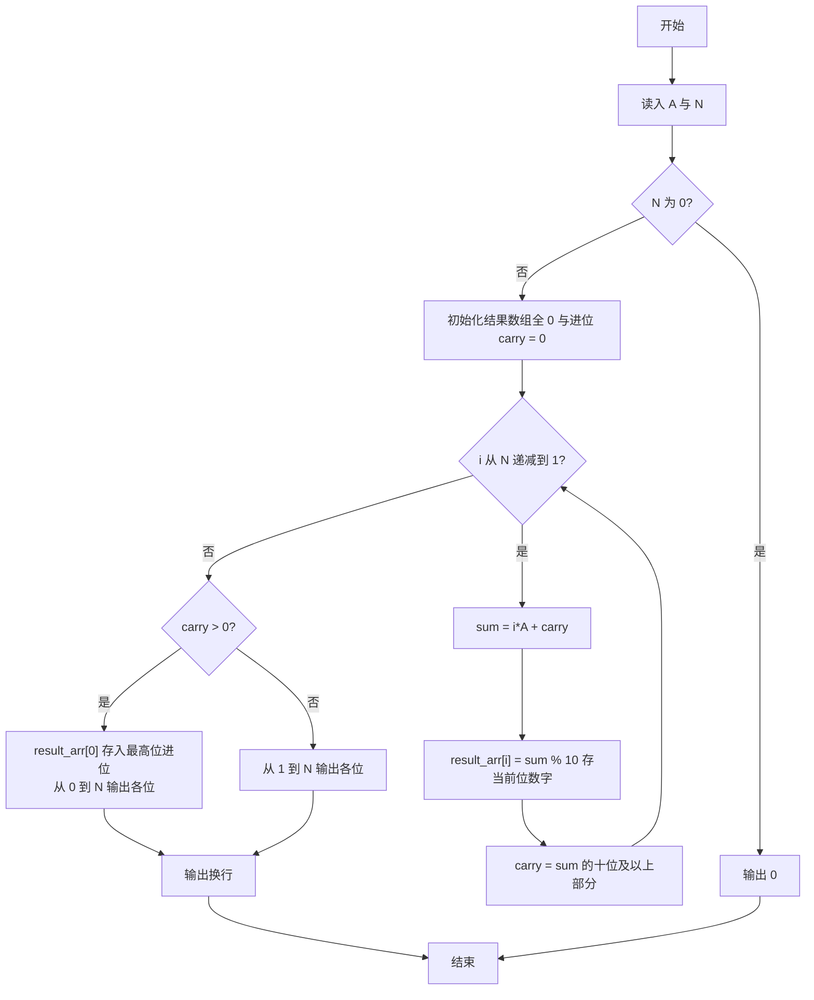
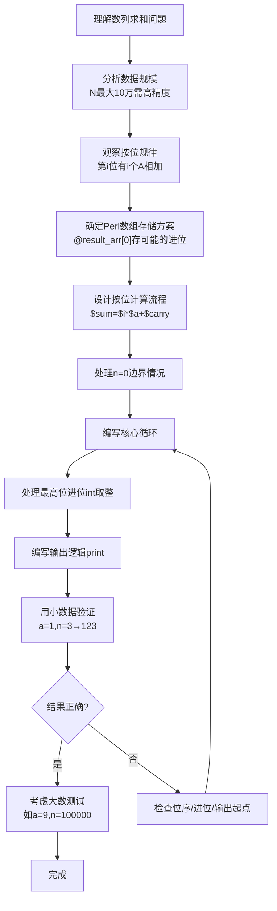

# 7-38 数列求和-加强版（Perl语言实现）

## 前言

本题（7-38 数列求和-加强版）的主要考点是：准确理解题意、规范处理输入输出格式，并正确处理边界与精度。下面先给出题目描述与格式要求，再通过清晰的思路与可直接运行的perl代码进行讲解。

## 题目描述

给定某数字A（1≤A≤9）以及非负整数N（0≤N≤100000），求数列之和S=A+AA+AAA+⋯+AA⋯A（N个A）。例如A=1, N=3时，S=1+11+111=123。

## 输入格式

输入数字A与非负整数N。

## 输出格式

输出其N项数列之和S的值。

## 输入样例

```in
1 3
```

## 输出样例

```out
123
```

## 解题思路

本题要求计算 S = A + AA + AAA + ...（共 N 项，每项由 N 个 A 组成），其中 N 最大可达 100000，结果远超普通整数范围，因此不能直接累加，而要模拟大数的竖式加法。观察规律：从低位到高位看，第 i 位（i 从 1 到 N）上共有 i 项需要相加，该位总和为 i*A 再加上来自低位的进位，取个位作为该位数字，其余部分进位到更高位。代码用 for 循环从 $i = $n 递减到 1 逐位计算，把每位数字存入结果数组 $result_arr[$i]，循环结束后把最高位剩余的进位存入 $result_arr[0]，最后按位顺序输出。N 为 0 时直接输出 0。

## 完整代码

```perl
#!/usr/bin/perl
use strict;
use warnings;

my ($a, $n) = split /\s+/, <STDIN>;
$n = 0 unless defined $n;
$a = 0 unless defined $a;

if ($n == 0) {
    print "0\n";
    exit;
}

my @result;
my $carry = 0;
for (my $i = $n; $i >= 1; $i--) {
    my $sum = $i * $a + $carry;
    push @result, $sum % 10;
    $carry = int($sum / 10);
}

while ($carry > 0) {
    push @result, $carry % 10;
    $carry = int($carry / 10);
}

print join('', reverse @result), "\n";
```

## 代码流程说明

1. 读入数字 A 与项数 N，并去除换行符。
2. 若 N 为 0，直接输出 0 并结束程序。
3. 初始化结果数组 @result_arr 全 0（下标 0 预留存最高位进位）与进位 $carry = 0。
4. for 循环从 $i = $n 递减到 1：计算 $sum = $i * $a + $carry（第 i 位有 i 个 A 相加）。
5. 把 $sum % 10 存入 $result_arr[$i] 作为当前位数字，$carry = int($sum / 10) 更新进位。
6. 循环结束后若 $carry > 0，把最高位进位存入 $result_arr[0]。
7. 有进位时从下标 0 到 n 依次输出各位；无进位时从下标 1 到 n 输出，最后输出换行。

## 代码流程图



## 解题流程图



## 代码解析

```perl
#!/usr/bin/perl
use strict;
use warnings;

my ($a, $n) = split /\s+/, <STDIN>;
$n = 0 unless defined $n;
$a = 0 unless defined $a;

if ($n == 0) {
    print "0\n";
    exit;
}

my @result;
my $carry = 0;
for (my $i = $n; $i >= 1; $i--) {
    my $sum = $i * $a + $carry;
    push @result, $sum % 10;
    $carry = int($sum / 10);
}

while ($carry > 0) {
    push @result, $carry % 10;
    $carry = int($carry / 10);
}

print join('', reverse @result), "\n";
```

读入数字 A 与项数 N，并去除换行符。

## 复杂度分析

设输入规模为 $n$（对数值类题目为参与运算的数据量，对字符串/序列类题目为长度）。

- **时间复杂度**：$O(n)$ 或 $O(n \log n)$，主要来自一次线性遍历与常数次数学运算，无嵌套高复杂度循环。
- **空间复杂度**：$O(n)$，用于存储输入、中间结果与输出字符串；若仅使用若干标量变量则为 $O(1)$。

## 常见易错点

### 1. 输入/输出格式不符
错误：多余空格、遗漏换行、大小写或精度不符。后果：判题系统判为格式错误。正确：严格按题目要求的格式输出，数值用合适精度。

### 2. 边界条件遗漏
错误：未处理 0、最小值、单字符或空输入等边界。后果：特例 WA。正确：先列出所有边界样例，在编码前单独分支处理。

### 3. 整数溢出与类型
错误：使用过小的整数类型或忽略负号。后果：大数计算溢出。正确：按数据范围选择合适类型，必要时用更大整数类型或字符串处理。

## 更多测试

### 测试一：常规边界

**输入：**

```text
（可取题目边界附近的值，如最小值或最大值）
```

**输出：**

```text
（依据题意推导的正确结果）
```

### 测试二：特殊用例

**输入：**

```text
（可取易错点，如 0、单一元素、全同值等）
```

**输出：**

```text
（对应正确结果）
```

## 总结

本题的核心在于理清「数列求和-加强版」的输入输出关系与边界处理：先按格式读取输入，再依据规则逐步计算或遍历，最后按规范输出。该思路可迁移到同类格式化输入输出与模拟计算的题目。

