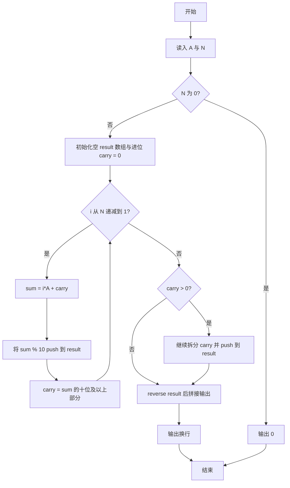
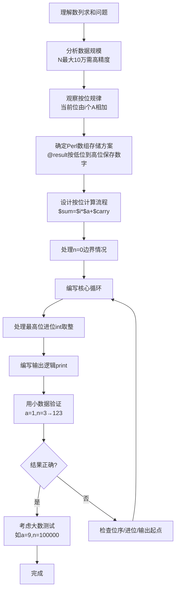

# 7-38 数列求和-加强版（Perl语言实现）

## 前言

本题（7-38 数列求和-加强版）的主要考点是：准确理解题意、规范处理输入输出格式，并正确处理边界与精度。下面先给出题目描述与格式要求，再通过清晰的思路与可直接运行的perl代码进行讲解。

## 题目描述

给定某数字A（1≤A≤9）以及非负整数N（0≤N≤100000），求数列之和S=A+AA+AAA+⋯+AA⋯A（N个A）。例如A=1, N=3时，S=1+11+111=123。

## 输入格式

输入数字A与非负整数N。

## 输出格式

输出其N项数列之和S的值。

## 输入样例

```in
1 3
```

## 输出样例

```out
123
```

## 解题思路

### 核心问题分析

N 最大为 100000，数列之和可能有数万位，不能把每一项或最终结果当作普通整数保存。需要利用每个数都由同一个数字 A 重复组成这一特点，直接按十进制的每一位进行累加，并用数组保存结果数字。

从右向左观察各位：个位由 N 个 A 相加，十位由 N-1 个 A 相加，依次递减，最高位只由 1 个 A 相加。因此，循环变量 `$i` 表示当前位上需要相加的项数，取值为 `$n`、`$n-1`、……、1，而不是结果数组的下标。

### 算法原理说明

模拟竖式加法。设当前位来自 `$i` 个数列项，且低位传来的进位为 `$carry`，则当前位的总和为：

```text
sum = i × A + carry
```

当前位数字是 `sum % 10`，新的进位是 `int(sum / 10)`。代码每次将当前位数字 `push` 到 `@result`，所以数组中的数字顺序是从低位到高位；全部计算结束后使用 `reverse` 还原为正常的高位到低位顺序。若循环结束后仍有进位，还要继续拆分并追加到结果数组。

### 具体计算步骤

1. 读入数字 A 和项数 N；若 N 为 0，直接输出 0。
2. 初始化空数组 `@result` 和进位 `$carry = 0`。
3. 令 `$i` 从 N 递减到 1：计算 `$sum = $i * $a + $carry`。
4. 将 `$sum % 10` 作为当前位存入 `@result`，并用 `int($sum / 10)` 更新进位。
5. 循环结束后，若 `$carry` 大于 0，继续逐位拆分并追加剩余进位。
6. 逆序输出 `@result` 中的数字，得到数列之和。

## 完整代码

```perl
#!/usr/bin/perl
use strict;
use warnings;

my ($a, $n) = split /\s+/, <STDIN>;
$n = 0 unless defined $n;
$a = 0 unless defined $a;

if ($n == 0) {
    print "0\n";
    exit;
}

my @result;
my $carry = 0;
for (my $i = $n; $i >= 1; $i--) {
    my $sum = $i * $a + $carry;
    push @result, $sum % 10;
    $carry = int($sum / 10);
}

while ($carry > 0) {
    push @result, $carry % 10;
    $carry = int($carry / 10);
}

print join('', reverse @result), "\n";
```

## 代码流程说明

### 1. 读取输入与处理边界

`split /\s+/, <STDIN>` 读取 A 和 N。两个 `unless defined` 语句为缺少输入提供默认值；当 `$n == 0` 时，数列没有任何项，程序直接输出 0 并退出。

### 2. 从低位到高位计算

`for (my $i = $n; $i >= 1; $i--)` 按照各位的贡献数从 N 递减到 1。第一次循环计算个位，下一次计算十位，依次向更高位推进。每一位都把当前贡献 `$i * $a` 与上一位的 `$carry` 相加。

### 3. 保存当前位和更新进位

`push @result, $sum % 10` 只保存总和的个位数字；`int($sum / 10)` 得到需要传给下一位的进位。由于采用 `push`，`@result` 始终按低位到高位排列。

### 4. 处理最高位的剩余进位

主循环结束后，`$carry` 可能仍包含一位或多位数字。`while ($carry > 0)` 继续取出其个位并加入 `@result`，避免遗漏结果的最高位。

### 5. 逆序输出

`join('', reverse @result)` 将低位到高位的数组逆转并拼接，不进行数值转换，因此可以安全输出超出普通整数范围的大数。

## 代码流程图



## 解题流程图



## 代码解析

```perl
#!/usr/bin/perl
use strict;
use warnings;

my ($a, $n) = split /\s+/, <STDIN>;
$n = 0 unless defined $n;
$a = 0 unless defined $a;

if ($n == 0) {
    print "0\n";
    exit;
}

my @result;
my $carry = 0;
for (my $i = $n; $i >= 1; $i--) {
    my $sum = $i * $a + $carry;
    push @result, $sum % 10;
    $carry = int($sum / 10);
}

while ($carry > 0) {
    push @result, $carry % 10;
    $carry = int($carry / 10);
}

print join('', reverse @result), "\n";
```

代码先读取 A 和 N，再以低位到高位的顺序完成逐位大数加法。

- **输入与边界**：读取两个参数；N 为 0 时直接输出 0。
- **逐位计算**：循环变量 `$i` 从 N 递减到 1，表示当前位包含 A 的项数。将 `$i * $a` 与进位相加后，分别用取模和整数除法得到当前数字与新进位。
- **结果保存**：当前数字依次压入 `@result`，因此数组是低位在前；循环后的剩余进位也按位拆分并压入数组。
- **输出**：逆序排列数组并用空字符串连接，避免将超大结果转换为普通数值。

## 复杂度分析

设 N 为数列项数。

- **时间复杂度**：`O(N)`，主循环恰好处理 N 个结果位，剩余进位的处理至多增加与结果位数同阶的工作量。
- **空间复杂度**：`O(N)`，数组 `@result` 保存结果的每一位。

## 常见易错点

### 1. 输入/输出格式不符
错误：多余空格、遗漏换行、大小写或精度不符。后果：判题系统判为格式错误。正确：严格按题目要求的格式输出，数值用合适精度。

### 2. 边界条件遗漏
错误：未处理 0、最小值、单字符或空输入等边界。后果：特例 WA。正确：先列出所有边界样例，在编码前单独分支处理。

### 3. 整数溢出与类型
错误：使用过小的整数类型或忽略负号。后果：大数计算溢出。正确：按数据范围选择合适类型，必要时用更大整数类型或字符串处理。

## 更多测试

### 测试一：常规边界

**输入：**

```text
9 1
```

**输出：**

```text
9
```

### 测试二：特殊用例

**输入：**

```text
2 3
```

**输出：**

```text
246
```

## 总结

本题的核心在于理清「数列求和-加强版」的输入输出关系与边界处理：先按格式读取输入，再依据规则逐步计算或遍历，最后按规范输出。该思路可迁移到同类格式化输入输出与模拟计算的题目。
