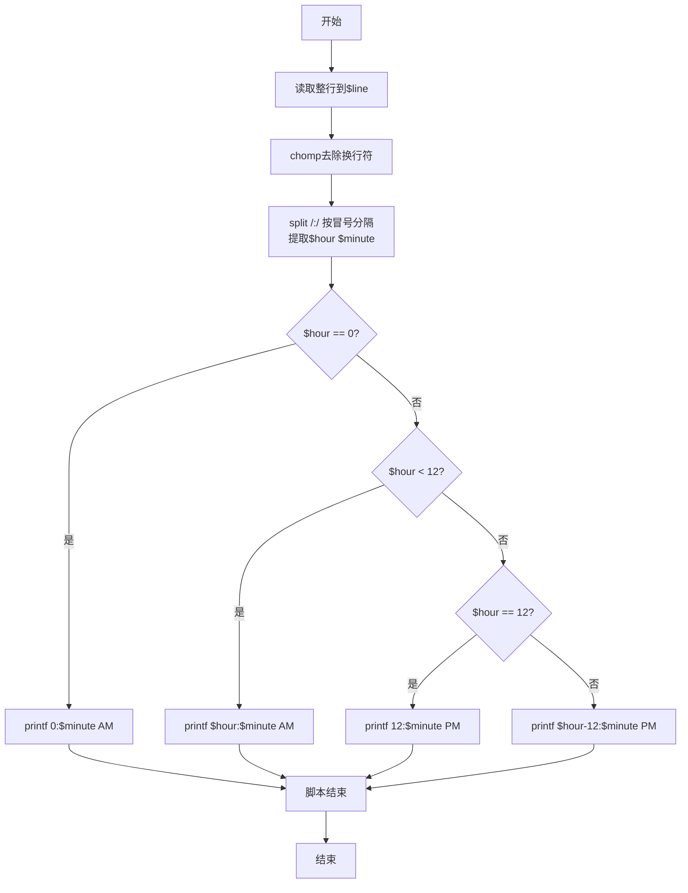
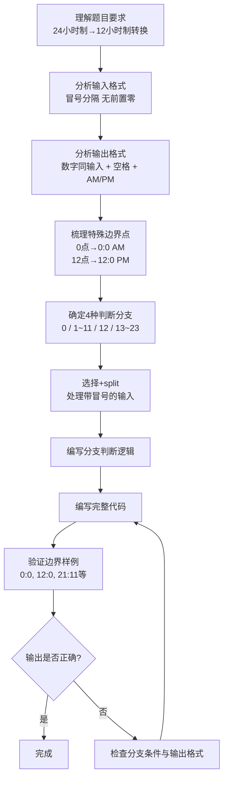

# 7-7 12-24小时制（Perl语言实现）

## 前言

本题（7-7 12-24小时制）的主要考点是：准确理解题意、规范处理输入输出格式，并正确处理边界与精度。下面先给出题目描述与格式要求，再通过清晰的思路与可直接运行的perl代码进行讲解。

## 题目描述

编写一个程序，要求用户输入24小时制的时间，然后显示12小时制的时间。

## 输入格式

输入在一行中给出带有中间的:符号（半角的冒号）的24小时制的时间，如12:34表示12点34分。当小时或分钟数小于10时，均没有前导的零，如5:6表示5点零6分。

提示：在scanf的格式字符串中加入:，让scanf来处理这个冒号。

## 输出格式

在一行中输出这个时间对应的12小时制的时间，数字部分格式与输入的相同，然后跟上空格，再跟上表示上午的字符串AM或表示下午的字符串PM。如5:6 PM表示下午5点零6分。注意，在英文的习惯中，中午12点被认为是下午，所以24小时制的12:00就是12小时制的12:0 PM；而0点被认为是第二天的时间，所以是0:0 AM。

## 输入样例

```in
21:11
```

## 输出样例

```out
9:11 PM
```

## 解题思路

### 1. 核心问题分析

本题需要完成两个核心任务：一是正确读取带有冒号分隔符的时间输入，二是根据24小时制到12小时制的转换规则进行分支判断输出。关键边界点在于0点、12点这两个特殊时间点的处理。

### 2. 算法原理说明

1. **带分隔符输入处理**：使用`<STDIN>`读取整行后通过正则匹配提取冒号分隔的小时和分钟。
2. **时间转换规则**（分4种情况）：
   - `$hour == 0`：凌晨0点 → 输出"0:分钟 AM"
   - `0 < $hour < 12`：上午 → 直接输出"小时:分钟 AM"
   - `$hour == 12`：中午12点 → 输出"12:分钟 PM"
   - `$hour > 12`：下午 → 小时减12，输出"(hour-12):分钟 PM"

### 3. 具体计算步骤

1. 读入整行字符串，chomp去除换行符，用正则匹配提取小时和分钟（处理冒号分隔）。
2. Perl在数值比较时会自动将字符串转为数字。
3. 按上述4种情况进行分支判断。
4. 用`printf`格式化输出转换后的时间和AM/PM标识。

## 完整代码

```perl
#!/usr/bin/perl
use strict;
use warnings;

chomp(my $line = <STDIN>);
my ($hour, $minute) = split /:/, $line;

if ($hour == 0) {
    printf("0:%d AM\n", $minute);
} elsif ($hour < 12) {
    printf("%d:%d AM\n", $hour, $minute);
} elsif ($hour == 12) {
    printf("12:%d PM\n", $minute);
} else {
    printf("%d:%d PM\n", $hour - 12, $minute);
}
```

## 代码流程说明

1. **读取整行输入**：使用`<STDIN>`读取包含冒号的完整时间字符串，存入`$line`变量。
2. **去除换行符**：调用`chomp($line)`去除字符串末尾的换行符。
3. **分割提取字段**：使用`split /:/, $line`，以冒号为分隔符提取小时和分钟，分别赋值给`$hour`和`$minute`。
4. **分支判断转换**：
   - 情况1：`$hour == 0` → 输出"0:分钟 AM"（凌晨零点）
   - 情况2：`$hour < 12`且不等于0 → 直接输出"小时:分钟 AM"（上午时段）
   - 情况3：`$hour == 12` → 输出"12:分钟 PM"（中午12点算下午）
   - 情况4：`$hour > 12` → 小时减12后输出"(hour-12):分钟 PM"（下午1点到11点）
5. **格式化输出**：每个分支内使用`printf`按"小时:分钟 AM/PM"格式拼接字符串，手动添加`\n`实现换行。

## 代码流程图



## 解题流程图



## 代码解析

```perl
#!/usr/bin/perl
use strict;
use warnings;

chomp(my $line = <STDIN>);
my ($hour, $minute) = split /:/, $line;

if ($hour == 0) {
    printf("0:%d AM\n", $minute);
} elsif ($hour < 12) {
    printf("%d:%d AM\n", $hour, $minute);
} elsif ($hour == 12) {
    printf("12:%d PM\n", $minute);
} else {
    printf("%d:%d PM\n", $hour - 12, $minute);
}
```

读取整行输入

## 复杂度分析

设输入规模为 $n$（对数值类题目为参与运算的数据量，对字符串/序列类题目为长度）。

- **时间复杂度**：$O(n)$ 或 $O(n \log n)$，主要来自一次线性遍历与常数次数学运算，无嵌套高复杂度循环。
- **空间复杂度**：$O(n)$，用于存储输入、中间结果与输出字符串；若仅使用若干标量变量则为 $O(1)$。

## 常见易错点

### 1. 输入/输出格式不符
错误：多余空格、遗漏换行、大小写或精度不符。后果：判题系统判为格式错误。正确：严格按题目要求的格式输出，数值用合适精度。

### 2. 边界条件遗漏
错误：未处理 0、最小值、单字符或空输入等边界。后果：特例 WA。正确：先列出所有边界样例，在编码前单独分支处理。

### 3. 整数溢出与类型
错误：使用过小的整数类型或忽略负号。后果：大数计算溢出。正确：按数据范围选择合适类型，必要时用更大整数类型或字符串处理。

## 更多测试

### 测试一：常规边界

**输入：**

```text
0:0
```

**输出：**

```text
0:0 AM
```

### 测试二：特殊用例

**输入：**

```text
12:0
```

**输出：**

```text
12:0 PM
```

## 总结

本题的核心在于理清「12-24小时制」的输入输出关系与边界处理：先按格式读取输入，再依据规则逐步计算或遍历，最后按规范输出。该思路可迁移到同类格式化输入输出与模拟计算的题目。
